# Claude Java Toolkit

> AI-powered tools for Oracle DB & Java/Spring enterprise development
> Powered by [Anthropic Claude API](https://docs.anthropic.com)

[](https://github.com/Sangmoo/Claude-Java-Toolkit/actions/workflows/build.yml)
[](LICENSE)
[](https://www.oracle.com/java/)
[](https://spring.io/projects/spring-boot)
[](#)
[](./helm/claude-toolkit)

---

## 🌐 프로젝트 소개 페이지

**👉 [https://sangmoo.github.io/Claude-Java-Toolkit/#ko](https://sangmoo.github.io/Claude-Java-Toolkit/#ko)**

프로젝트의 전체 기능, 설치 방법, REST API 목록을 한눈에 확인할 수 있는 GitHub Pages 소개 페이지입니다.
한국어(`#ko`) / 영어(`#en`) 전환을 지원합니다.

---

## ✨ 소개

`claude-java-toolkit`은 Java/Spring 엔터프라이즈 환경에서 Claude API를 실무에 바로 활용할 수 있는 오픈소스 툴킷입니다.

Python용 Claude 통합 도구는 많지만, **JDK 1.8+ / Oracle 11g+ / Spring Boot 레거시 환경**에 특화된 Java 통합 라이브러리는 거의 없습니다.

국내 SI / 금융 / 유통 환경의 현실을 반영하여 설계되었습니다.

### 🆕 v4.7.0 하이라이트 — 인사이트 + 컴플라이언스 + UX 풀 스택 업그레이드

5개 큰 영역을 한 번에 끌어올린 메이저 릴리스. 각 항목은 운영팀 / 외부감사인 / 사용자
모두를 별도 시나리오로 지원하도록 설계됐고, 모든 변경은 *기존 파이프라인 부담 없이*
선택적으로 활성화/사용할 수 있습니다.

- 🛡 **한국 컴플라이언스 리포트 (4종, ADMIN 전용 신규 페이지)** — `/admin/compliance-report`
  - **전자금융감독규정 (FSS)** / **개인정보보호법 (PIPA)** / **정보통신망법** / **외부감사 종합**
    4종 모두 활성화. 8\~10개 섹션 markdown + 자동 점검 표 + 수동 검토 체크리스트.
  - 외부감사 종합 리포트는 **3개 법령 횡단 비교 표** 로 ✅/⚠️ 한눈에 파악 가능
  - 다운로드 3종: **.md / .xlsx (Apache POI 4시트) / 인쇄·PDF** (브라우저 네이티브 저장)
  - 옵션 **🤖 AI 경영진 요약** — Claude 가 3-5문장 한국어 요약을 markdown 상단에 prepend
  - **영구 저장 이력** — 생성된 리포트는 H2 DB(`compliance_report` 테이블)에 자동 저장,
    "저장된 리포트 이력" 모달에서 과거 리포트 다시 보기·다운로드·삭제 (최대 500건)
- 🔬 **시스템 헬스 대시보드 확장** — `/admin/health` 가 기존 4개 카드(서버/JVM/DB/시스템) +
  **5개 신규 카드** (인덱서 5종 / 캐시 3종 / Claude API / 감사 로그 / 오류 로그) 로 확장.
  silent JPQL 실패 같은 사고가 또 발생하면 운영팀이 즉시 발견 가능. 30초 자동 갱신.
- 📊 **사용자/팀 인사이트 (`/roi-report` 확장)** — 기존 시스템 통계 + 새 두 섹션:
  - *내 활동* — 본인 분석/채팅/시간 절감 + Top 5 기능 BarChart + 12주 누적 LineChart
  - *팀 비교* — 팀 평균/누적 + **본인 순위·백분위 시각 진행 바** + Top 5 사용자 (ADMIN)
- 🔍 **검색 강화 (필터 + 정렬 + 매치 강조)** — `/api/v1/search` 에 type/from/to/sort 파라미터,
  매치 위치 ±60자 발췌 snippet, 결과에 `<mark>` 노란 강조. SearchPage 에 필터 토글 + URL 동기화.
- ⚡ **분석 비용 미리보기** — 모든 분석 시작 버튼 옆에 인라인 표시:
  `🪙 ~12K 토큰 · 예상 $0.062 (Sonnet 4)`. 한국어 1.8 chars/token + 영어 3.5 chars/token
  휴리스틱(±15% 오차). 23개 분석 페이지 자동 적용.
- 🧪 **SSE 회귀 테스트 4건 + FSS 단위 테스트 8건** — 스트리밍 경로 이력 저장 누락 / 리포트
  markdown 빌더 회귀 방지. mvn test 한 번이면 백엔드 전반 검증.

### v4.6.1 하이라이트 — UX 개선 + 정확도/안정성 패치

이번 패치는 사용자 워크플로의 자잘한 마찰을 한 번에 정리하는 데 집중했습니다. 큰 신규 기능은 없지만, **현장에서 바로 체감되는** 개선이 모여 있습니다.

- 🔎 **상단바 글로벌 검색** — 모든 페이지의 상단 가운데 영역에 검색창이 상시 노출됩니다. Settings 팔레트의 accent 색상으로 테두리가 자동 동기화되고 (테마 변경 시 즉시 추종), Enter / 버튼 클릭으로 `/search?q=...` 로 이동합니다. URL 파라미터로 진입하면 자동 검색되어 공유·새로고침에 안전.
- 🗂 **검색 페이지 — 메뉴 + 이력 통합** — 메뉴 카탈로그를 클라이언트 필터로 즉시 매칭(예: "하네스" → 코드 리뷰/SP→Java/SQL 최적화 하네스 3건) + 백엔드 `/api/v1/search` 가 `review_history` 의 `type/title/inputContent/outputContent` 4개 컬럼을 LIKE 검색해 메뉴와 분석 이력을 한 화면에 보여 줍니다.
- 🐛 **검색 백엔드 버그 수정** — 이전 구현은 존재하지 않는 `h.menuName` / `h.inputText` 필드를 참조해 JPQL 이 매번 throw 하고 silent catch 가 빈 결과만 반환하던 결정적 버그가 있었습니다. 실제 엔티티 필드(`type`/`title`/`inputContent`/`outputContent`) 로 정정하고, 프론트엔드 친화 DTO(`{id, menuName, title, snippet, createdAt}`) 로 평탄화 응답.
- 💾 **분석 이력 저장 — 4개 기능 추가/수정** — 기존엔 동기 `/analyze` 경로만 `review_history` 에 저장됐고 SSE 스트리밍 경로는 누락이었습니다. 이번 패치로 **테이블 영향 분석 / SP→Java 마이그레이션 하네스 / SQL 최적화 하네스 / 오류 로그 RCA 하네스** 가 스트리밍 완료 시점에도 저장되도록 통일. `ReviewHistoryService.save(type, input, output, username)` 오버로드를 추가해 백그라운드 스레드에서도 username 을 명시 전달 가능.
- 📋 **테이블 영향 분석 — 파일 모달 뷰어 + 클립보드 복사** — `/impact` 페이지에서 MiPlatform 단계는 제외하고 `TABLE → MyBatis → Java → Controller` 4단계만 노출. **MyBatis 구문 / Java 파일 / Controller 행 모두 클릭하면 모달로 전체 소스가 열리고**, 우상단 "전체 복사" 버튼으로 클립보드에 즉시 복사. 백엔드 `GET /api/v1/flow/file?path=...` 엔드포인트(scanPath 제한, 5MB 상한, path-traversal 방어) 신설.
- 🛠 **MyBatisCallerIndex false-positive 제거** — 같은 shortId(예: `insertOrder`) 를 가진 mapper 가 여러 개 존재할 때, 단순 `.shortId(` 매칭만으로 모든 mapper 의 호출자로 잘못 기록되던 버그가 있었습니다. 이제 fullId 별 **mapperClass 명이 그 Java 파일에 단어 경계로 존재하는지** 까지 검증해 무관한 매퍼·서비스가 끌려나오지 않습니다 (테이블 영향 분석에서 Java/Controller 결과가 부풀어 보이던 문제 해결).
- 🔌 **DB 객체 캐시 — TABLE 포함** — `HarnessCacheService` 가 `ALL_OBJECTS` 에서 PROCEDURE/FUNCTION/PACKAGE/TRIGGER 만 가져오던 것을 **TABLE / VIEW 까지 확장**. "소스선택하기" 버튼이 새 메뉴에서 테이블 픽커로 동작.
- 🎯 **소스선택하기 버튼 — 메뉴별 타입 필터링** — `SourceSelector` 에 `dbTypes` 화이트리스트 + `pickName`(이름만 반환) 옵션 추가. 메뉴별 적용:
  - 테이블 영향 분석 → `TABLE` 만
  - SP→Java 하네스 / SQL 최적화 하네스 → DB 오브젝트 (Java 파일 탭 제거)
- 🐞 **하네스 스트리밍 마크다운 줄바꿈 버그 수정** — `useHarnessStream` 이 매 SSE 메시지마다 `'\n'` 을 인위적으로 덧붙이고 있어 Claude 가 단어 중간("활"/"용") 에서 청크를 끊으면 `"활\n용"` 이 마크다운 soft-break 로 단어가 갈라져 보이던 버그. flush 기준을 줄바꿈 단위에서 **STAGE_MARKER prefix 보호**로 변경하여 단어 분리 0건.
- 🗑 **메뉴 정리** — 패키지 의존성 그래프(`/package-deps`) · SP 흐름 분석(`/sp-impact`) 두 메뉴를 백엔드 엔드포인트 + 프론트 라우트 + e2e 회귀 테스트까지 완전 제거. 잔존 참조 0건.

### v4.6.0 하이라이트 — 하네스 파이프라인 확장 (Phase A · D · B · C)

기존 "코드 리뷰 하네스" 의 4단계(Analyst → Builder → Reviewer → Verifier) 패턴을 **공통 인프라로 추출**하고, 운영팀·DBA가 자주 마주하는 3가지 시나리오에 동일 패턴을 적용했습니다. 4개 하네스가 같은 Orchestrator·PromptLoader·UI 컴포넌트를 공유합니다.

- 🛠 **공통 하네스 인프라 (Phase A)** — `HarnessOrchestrator` (sync + SSE 스트리밍, sentinel 자동 emit) · `PromptLoader` (`prompts/harness/{name}/{stage}.md` classpath 외부화 + 경로 인젝션 차단) · `HarnessAuditWriter` (옵셔널 감사 로그, `toolkit.harness.audit=true`) · 재사용 가능한 React `useHarnessStream` 훅 + `<HarnessStagePanels />` 컴포넌트
- 🐞 **오류 로그 RCA 하네스 (Phase D)** — `/loganalyzer` 페이지에 "RCA 하네스 (4단계)" 모드 토글. **일반 RCA / 보안 RCA(OWASP Top 10)** 두 모드 지원. 가설 후보 → 검증 SQL+패치+롤백 계획 → 우도 평가 → 사내 표준 RCA 보고서 + 재발 방지 체크리스트 자동 생성
- 🔄 **SP→Java 마이그레이션 하네스 (Phase B)** — `/sp-migration-harness` 신규 페이지. **DB 오브젝트 선택 버튼**으로 Oracle SP/Function/Package/Trigger를 ALL_SOURCE에서 자동 로드. SP 의미 분석 → Service+Mapper+XML+DTO+테스트 생성 → 행위 동등성 검증 → 컴파일·MyBatis XML 정합성 정적 검증
- ⚡ **SQL 최적화 하네스 (Phase C)** — `/sql-optimization-harness` 신규 페이지. 쿼리·실행계획·통계·인덱스·변경 불가 제약 다중 입력 → 병목 분석 → **N개 후보 (rewrite + DDL + 힌트, 비용/리스크/롤백)** → 결과 동등성·다른 쿼리 영향 평가 → 단계별 Rollout Plan
- 🔒 **권한 게이팅 통합** — 3개 신규 feature key (`loganalyzer-harness`, `sp-migration-harness`, `sql-optimization-harness`)가 어드민 권한 화면에서 즉시 ON/OFF. URL/CSRF/사이드바 메뉴까지 자동 적용
- 🧪 **테스트 27건 신규** — Orchestrator/PromptLoader 14 + Log RCA 10 + SP Migration 9 + SQL Optimization 6 + 권한 등록 회귀 방지 3. 전체 142개 테스트 통과, 회귀 0건

### v4.5.0 하이라이트
- 📦 **패키지 분석 (신규)** — Java 패키지 단위 4탭 분석 (`/package-overview`):
  - 📊 요약 — 클래스 / Controller / Service / DAO / MyBatis 통계
  - 🔗 ERD — 연관 테이블 Mermaid + heatmap (히트카운트)
  - 🌊 풀 흐름도 — 패키지가 건드리는 모든 테이블 → MyBatis → Java → Controller 자동 병합
  - 📜 스토리 — Claude 가 신입 친화 한국어 마크다운 내러티브 생성
- 🗺 **전사 패키지 지도 (신규)** — `/project-map` 드릴다운 카드 그리드 + 검색 필터, 리프 레벨 도달 시 패키지 개요로 점프
- 🔒 **보안 강화** — `POST /api/v1/package/refresh` ADMIN 권한 강제, `prefix` 200자 길이 캡
- ⏱ **Claude 호출 45s 타임아웃** — `PackageStoryService` 가 외부 지연으로 톰캣 스레드를 hang 시키지 않음
- 🛠 **`toolkit.indexer.*` 외부화** — `application.yml` 로 `maxJavaScan` / `maxFileSize` 튜닝
- 📤 **패키지 스토리 Markdown export** — `GET /api/v1/package/story/export?name=...` 위키 복붙용
- 📊 **어드민 캐시 통계** — `GET /api/v1/admin/caches` (ADMIN 전용)
- 🧪 **테스트 12개 신규** — `PackageAnalysisControllerTest` + `PackageStoryServiceTest`

### v4.4.0 하이라이트
- 📜 **OpenAPI / Swagger UI** — `/swagger-ui.html` (ADMIN 전용) 인터랙티브 API 카탈로그 + `/v3/api-docs` JSON 스펙
- 🐞 **자체 에러 모니터링 (Sentry-style)** — `/admin/error-log` dedupe + 자동 unresolved 복귀 + 스택트레이스 보존
- 📈 **메트릭 5종 신규** — 캐시 / SSE / 하네스 4단계 / 에러율 / 파이프라인 단계. Grafana 18 패널
- ⎈ **Helm Chart Kind 자동 검증** — `bash scripts/test-helm.sh` 한 번에 검증
- 🤖 **자동 변경 로그** — release-please-action — feat/fix commit → CHANGELOG.md + GitHub Release 자동 생성
- 🧪 **테스트 64개 + JaCoCo** — 커버리지 자동 리포팅
- 🔁 **데이터 흐름 분석** — 테이블/SP/SQL_ID 시작점에서 MyBatis · Java · Controller · MiPlatform 까지 자동 추적 → ReactFlow 다이어그램 + LLM narrative + 분석 이력/공유 링크. `/flow-analysis` (Admin 권한 관리에서 사용자별 on/off)

> 📋 전체 변경 이력은 [CHANGELOG.md](./CHANGELOG.md) — release-please 가 자동 갱신

---

## 📸 데모

> 캡처 가이드: [`docs/screenshots/README.md`](./docs/screenshots/README.md)

### 핵심 기능

| 홈 대시보드 | SQL 리뷰 |
|:---:|:---:|
| 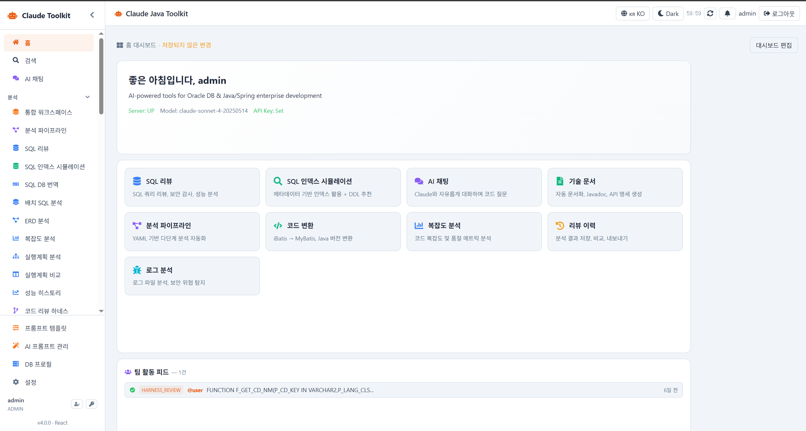 | 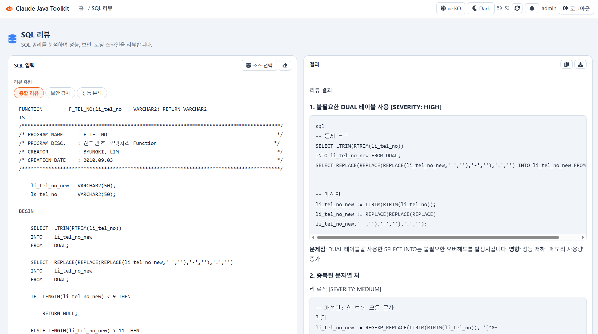 |
| **파이프라인 그래프** | **4단계 하네스** |
| 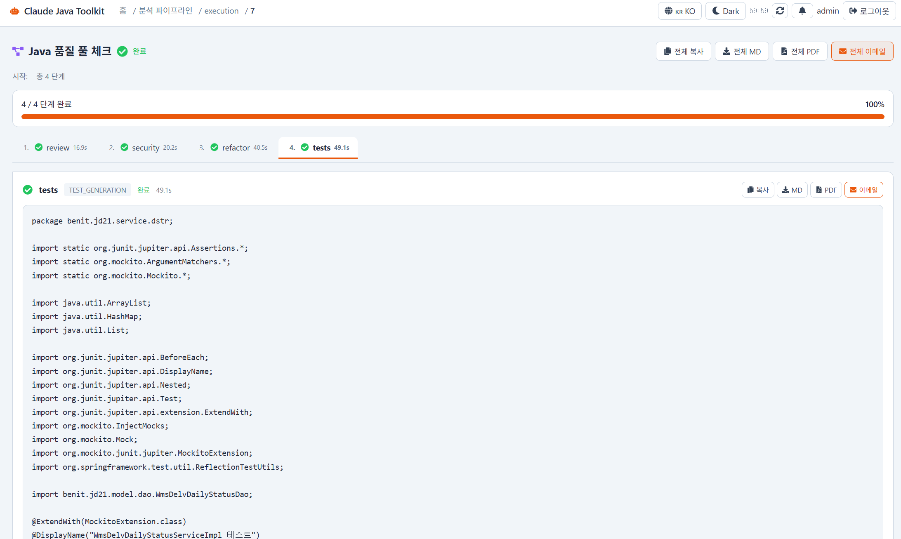 | 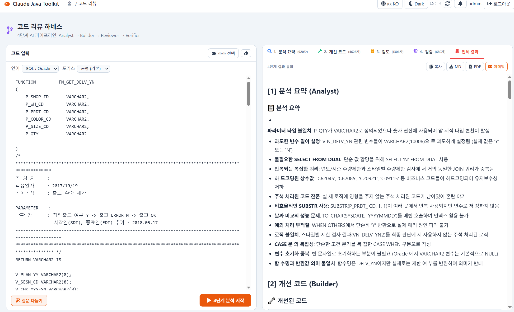 |

### v4.3.0 신규

| SQL 인덱스 시뮬레이션 | 비용 옵티마이저 |
|:---:|:---:|
| 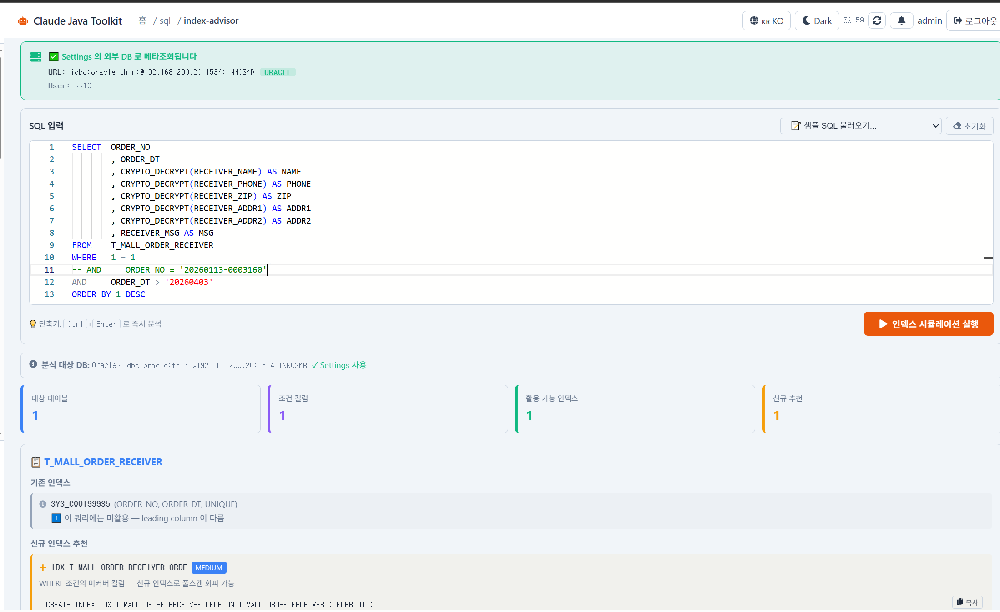 | 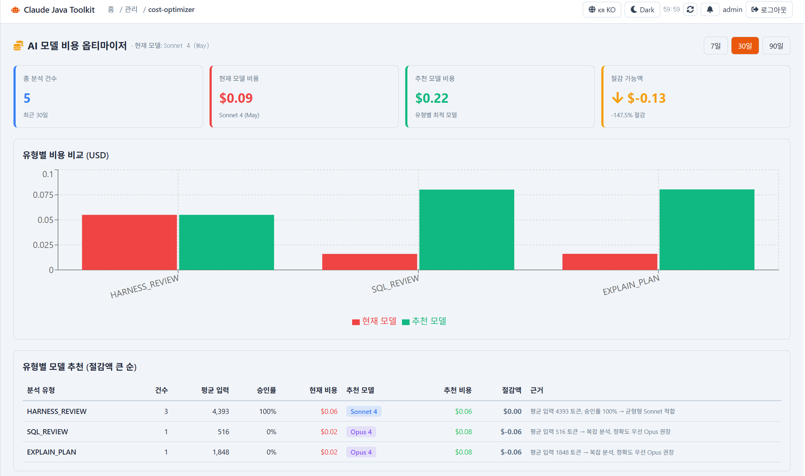 |
| **언어 선택 (5개 언어)** | **대시보드 편집 모드** |
| 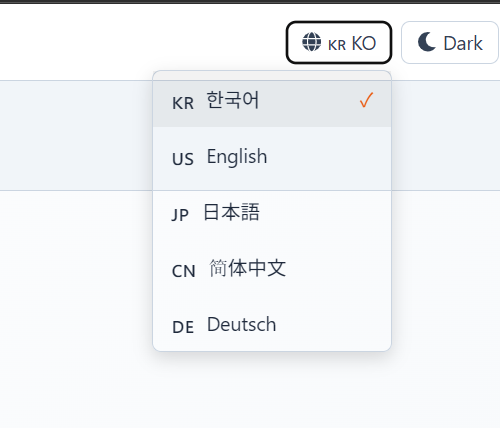 | 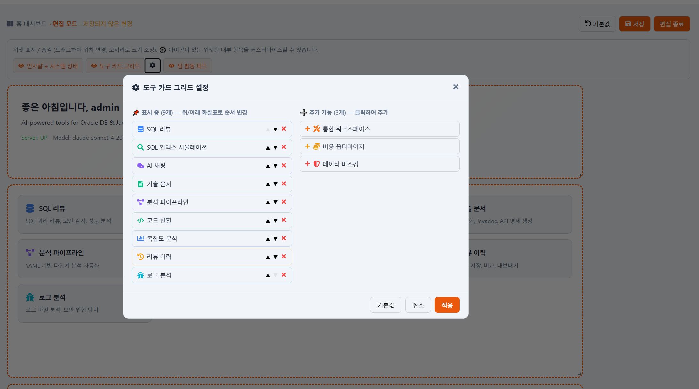 |

### v4.4.0 신규

| Swagger UI | 오류 로그 (Sentry-style) | Grafana 대시보드 |
|:---:|:---:|:---:|
| 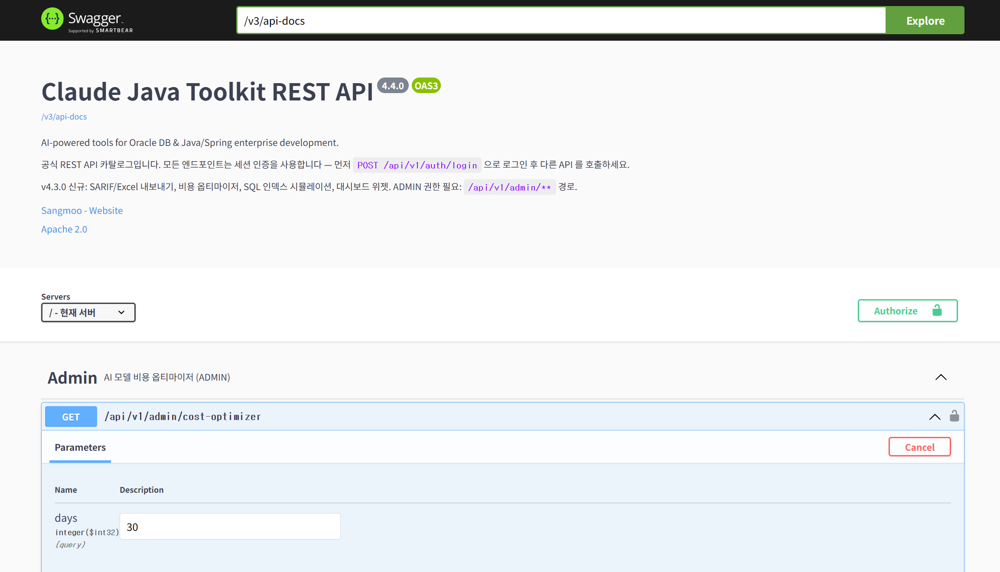 | 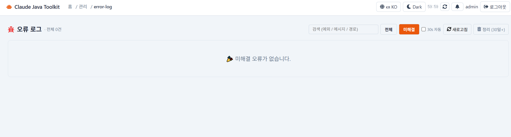 | 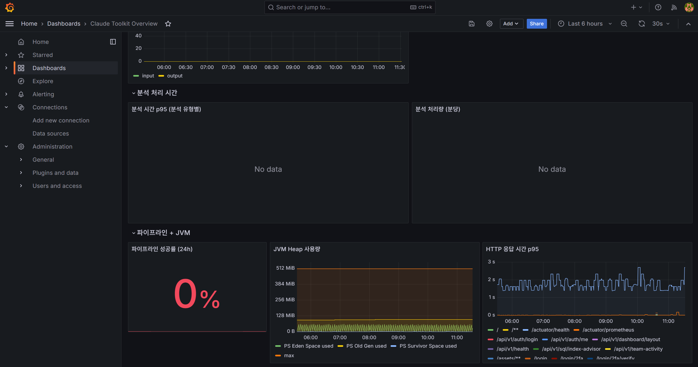 |

---

### v4.3.0 하이라이트

| 카테고리 | 주요 기능 |
|---------|----------|
| 📤 **데이터 내보내기** | SARIF 2.1.0 (IDE 연동) / Excel 워크북 (3 시트 + 합계 수식) |
| 📈 **모니터링** | Prometheus + Grafana 자동 프로비저닝 (`docker-compose --profile monitoring`) |
| 💰 **비용 최적화** | AI 모델 비용 옵티마이저 — 분석 유형별 최적 모델 추천 (Haiku/Sonnet/Opus) |
| ⚡ **DB 분석** | SQL 인덱스 임팩트 시뮬레이션 — 정적 파싱 + JDBC 메타조회 + DDL 자동 생성 |
| 🌍 **다국어** | 한 / 영 / 일 / 중 / 독 (5개 언어) + 사용자별 자동 동기화 |
| 📐 **대시보드** | 위젯 드래그/리사이즈/숨김 + 사용자별 레이아웃 영속화 |
| 🌳 **워크플로** | 파이프라인 인터랙티브 그래프 (reactflow) |
| ⎈ **K8s 배포** | Helm Chart (Deployment + Service + Ingress + HPA + ServiceMonitor) |

---

## 📦 모듈 구성

| 모듈 | 설명 | 형태 |
|------|------|------|
| [`claude-spring-boot-starter`](./claude-spring-boot-starter) | `application.yml` 설정만으로 `ClaudeClient` Bean 자동 주입. SSE 스트리밍 + 런타임 모델 전환 지원 | Library |
| [`claude-sql-advisor`](./claude-sql-advisor) | SQL / Oracle SP 리뷰, 보안 감사, 인덱스 최적화 제안, ERD 분석, Mock 데이터 생성, DB 마이그레이션 | Library + CLI |
| [`claude-doc-generator`](./claude-doc-generator) | 기술 문서(Oracle Package 포함), Javadoc 생성, 리팩터링 제안, 테스트 코드, API 명세, 코드 변환(iBatis 지원), 코드 리뷰, 복잡도 분석, pom.xml 의존성 분석, 데이터 마스킹, Spring 마이그레이션, 로그 분석, 정규식 생성, 커밋 메시지 생성 | Library + CLI |
| [`claude-toolkit-ui`](./claude-toolkit-ui) | 위 기능들을 웹 브라우저에서 사용하는 React SPA 대시보드 (v4.0 전환) | Spring Boot + React |

---

## 🚀 Quick Start

### 1. 사전 요구사항

- JDK 1.8+
- Maven 3.6+
- Node.js 18+ (React 빌드 — `frontend-maven-plugin`이 자동 설치하므로 선택)
- [Anthropic API Key](https://console.anthropic.com)

### 2. Clone & Build

```bash
git clone https://github.com/Sangmoo/Claude-Java-Toolkit.git
cd claude-java-toolkit

# Maven 빌드 (React 프론트엔드 자동 빌드 포함)
mvn clean package -DskipTests
```

`frontend-maven-plugin`이 자동으로 Node.js 설치 → `npm install` → `npm run build`를 수행합니다.
빌드 결과물은 `claude-toolkit-ui/src/main/resources/static/app/`에 생성됩니다.

> **프론트엔드만 개발할 때**: `cd claude-toolkit-ui/frontend && npm run dev` (Vite 개발 서버 5173 포트)
> **IntelliJ 사용자**: Maven 패널에서 루트 프로젝트 → `Lifecycle` → `package` 더블클릭

### 3. Web UI 실행

```bash
# Mac / Linux
export CLAUDE_API_KEY=sk-ant-...

# Windows PowerShell
$env:CLAUDE_API_KEY="sk-ant-..."

cd claude-toolkit-ui
mvn spring-boot:run
```

브라우저에서 `http://localhost:8027` 접속 → 설치 마법사 또는 로그인 페이지로 이동

> **초기 로그인**: admin / admin1234

### 4. Docker 배포 (선택)

```bash
# 1. 환경변수 설정
cp .env.example .env
# .env 파일에서 CLAUDE_API_KEY 설정

# 2-A. H2 DB (기본값, 별도 DB 불필요)
docker-compose up -d claude-toolkit

# 2-B. MySQL 사용 시
DB_TYPE=mysql docker-compose --profile mysql up -d

# 2-C. PostgreSQL 사용 시
DB_TYPE=postgresql docker-compose --profile postgresql up -d

# 2-D. Prometheus + Grafana 모니터링 스택 함께 실행 (v4.3.0)
docker-compose --profile monitoring up -d
# → Grafana:    http://localhost:3000 (admin/admin)
# → Prometheus: http://localhost:9090
# → "Claude Toolkit Overview" 대시보드 자동 프로비저닝 (10개 패널)

# 위 옵션들은 조합 가능:
DB_TYPE=postgresql docker-compose --profile postgresql --profile monitoring up -d
```

| 환경변수 | 설명 | 기본값 |
|----------|------|--------|
| `CLAUDE_API_KEY` | Anthropic API 키 | (필수) |
| `DB_TYPE` | 내부 DB 유형 (`h2`/`mysql`/`postgresql`) | `h2` |
| `DB_HOST` | DB 호스트 (MySQL/PG) | `db` |
| `DB_PORT` | DB 포트 | `3306` |
| `DB_NAME` | DB 이름 | `claude_toolkit` |
| `DB_USERNAME` / `DB_PASSWORD` | DB 계정 | `claude` / `claude1234` |
| `PORT` | 웹 서버 포트 | `8027` |
| `GRAFANA_USER` / `GRAFANA_PASSWORD` | Grafana 관리자 계정 (monitoring 프로필) | `admin` / `admin` |

> Kubernetes / Helm 배포는 아래 [🚢 배포 가이드](#-배포-가이드-deployment-guide) 섹션 참고.

### 5. 설치 마법사

최초 실행 시 `/setup` 페이지로 자동 이동합니다:

1. **API 키 입력** → 저장 + 연결 테스트
2. **Oracle DB 설정** → 저장 + 연결 테스트 (선택)
3. **이메일 설정** (나중에 Settings에서 설정 가능)
4. **완료** → 관리자 계정 확인

> "나중에 설정하기" 버튼으로 스킵하고 Settings에서 개별 설정할 수 있습니다.

### 6. 헬스체크

```bash
curl http://localhost:8027/actuator/health
```

```json
{
  "status": "UP",
  "components": {
    "claudeApi": { "status": "UP", "details": { "model": "claude-sonnet-4-20250514", "responseTime": "342ms" } },
    "oracleDb":  { "status": "UNKNOWN", "details": { "reason": "Oracle DB 미설정" } }
  }
}
```

---

## 🚢 배포 가이드 (Deployment Guide)

> v4.3.0 기준 — 환경에 따라 3가지 옵션 중 선택하세요.

### 📋 옵션 비교 매트릭스

| 항목 | 🟢 Docker Compose | 🟡 JAR 직접 실행 | 🔵 Kubernetes (Helm) |
|------|------------------|-----------------|---------------------|
| 설치 난이도 | ⭐ | ⭐ | ⭐⭐⭐ |
| 다중 인스턴스 | ❌ | ❌ | ✅ |
| 자동 스케일링 (HPA) | ❌ | ❌ | ✅ |
| 무중단 배포 | ❌ | 수동 | ✅ |
| Prometheus 연동 | ✅ (Compose 프로필) | ❌ | ✅ (ServiceMonitor) |
| 영속 볼륨 | ✅ (volume) | OS FS | ✅ (PVC) |
| Ingress / TLS | 별도 설정 | 별도 설정 | ✅ (annotation 1줄) |
| 권장 환경 | 개발 / 소규모 (~10명) | VM 단일 서버 | **운영, 다중 사용자** |

---

### 🟢 옵션 1 — Docker Compose (가장 간단)

```bash
# 1. 환경변수 설정
cp .env.example .env
# .env 에서 CLAUDE_API_KEY=sk-ant-... 설정

# 2-A. H2 DB (기본 — 별도 DB 불필요)
docker-compose up -d

# 2-B. MySQL 사용
DB_TYPE=mysql docker-compose --profile mysql up -d

# 2-C. PostgreSQL 사용
DB_TYPE=postgresql docker-compose --profile postgresql up -d

# 2-D. Prometheus + Grafana 모니터링 스택 함께 실행
docker-compose --profile monitoring up -d
#  → Grafana:    http://localhost:3000 (admin/admin)
#  → Prometheus: http://localhost:9090
#  → "Claude Toolkit Overview" 대시보드 자동 프로비저닝

# 조합 가능 — 외부 PG + 모니터링 동시 활성화
DB_TYPE=postgresql docker-compose --profile postgresql --profile monitoring up -d
```

---

### 🟡 옵션 2 — JAR 직접 실행 (Docker 미사용 환경)

```bash
# 1. 빌드
mvn clean package -DskipTests

# 2. 환경변수 설정 + 실행
export CLAUDE_API_KEY=sk-ant-...
export DB_TYPE=h2                              # 또는 mysql / postgresql
java -jar claude-toolkit-ui/target/claude-toolkit-ui-0.1.0-SNAPSHOT.jar

# 또는 systemd 서비스로 등록 (CentOS/Ubuntu)
sudo cp claude-toolkit.service /etc/systemd/system/
sudo systemctl enable --now claude-toolkit
```

**적합한 경우**: Docker 미사용 사내 VM, 간단한 단일 서버 운영

---

### 🔵 옵션 3 — Kubernetes (Helm Chart)

> ⚠️ **현재 상태**: `helm/claude-toolkit/` v0.1.0 — `helm template` 정적 검증만 완료. 실제 K8s 환경 적용 전 테스트 클러스터 검증 권장.

#### Helm Chart 보는 법

GitHub 또는 로컬 저장소의 다음 경로:

```
helm/claude-toolkit/
├── Chart.yaml          ← 차트 메타정보 (이름, 버전, appVersion)
├── values.yaml         ← 모든 설정값 + 한글 주석 (튜닝 시 이 파일만 보면 됨)
├── README.md           ← 6가지 설치 시나리오 + 옵션 표
└── templates/
    ├── _helpers.tpl    ← 공통 헬퍼 (이름, 라벨)
    ├── deployment.yaml ← 앱 컨테이너 + env + healthcheck
    ├── service.yaml    ← ClusterIP
    ├── ingress.yaml    ← Ingress (옵션)
    ├── secret.yaml     ← Claude API Key + DB Password
    ├── pvc.yaml        ← H2 모드 영속화 볼륨
    ├── hpa.yaml        ← Horizontal Pod Autoscaler
    ├── serviceaccount.yaml
    ├── servicemonitor.yaml ← prometheus-operator 연동
    └── NOTES.txt       ← 설치 후 안내 메시지
```

#### 로컬에서 차트 검증 (3단계)

##### 1단계 — 도구 설치 (한 번만)

**Windows (winget — 권장)**:
```powershell
# 사전: Docker Desktop 설치되어 있어야 함
winget install Kubernetes.kind            # Kind (Kubernetes in Docker)
winget install Kubernetes.kubectl         # kubectl
winget install Helm.Helm                  # Helm
```

**macOS**:
```bash
brew install kind kubectl helm
```

**Linux (Ubuntu/Debian)**:
```bash
# Kind
[ $(uname -m) = x86_64 ] && curl -Lo ./kind https://kind.sigs.k8s.io/dl/v0.22.0/kind-linux-amd64
chmod +x ./kind && sudo mv ./kind /usr/local/bin/kind

# kubectl
curl -LO "https://dl.k8s.io/release/$(curl -L -s https://dl.k8s.io/release/stable.txt)/bin/linux/amd64/kubectl"
sudo install -o root -g root -m 0755 kubectl /usr/local/bin/kubectl

# Helm
curl https://baltocdn.com/helm/signing.asc | gpg --dearmor | sudo tee /usr/share/keyrings/helm.gpg > /dev/null && \
  echo "deb [arch=$(dpkg --print-architecture) signed-by=/usr/share/keyrings/helm.gpg] https://baltocdn.com/helm/stable/debian/ all main" | sudo tee /etc/apt/sources.list.d/helm-stable-debian.list && \
  sudo apt-get update && sudo apt-get install helm
```

##### 2단계 — 자동 검증 스크립트 실행 (10~15분)

```bash
# 환경변수 설정 (있으면 좋음, 없어도 동작)
export CLAUDE_API_KEY=sk-ant-...

# 검증 자동 실행
bash scripts/test-helm.sh

# 옵션:
bash scripts/test-helm.sh --skip-build   # 이미지 재빌드 생략 (재실행 시)
bash scripts/test-helm.sh --keep         # 검증 후 클러스터 유지 (수동 디버깅)
```

스크립트가 자동으로:
1. ✅ 도구 설치 확인 (docker / kind / kubectl / helm)
2. ✅ Kind 클러스터 `claude-test` 생성
3. ✅ Docker 이미지 빌드 → Kind 클러스터에 로드 (registry 불필요)
4. ✅ Namespace + Secret 생성
5. ✅ `helm lint` + `helm template` 정적 검증
6. ✅ `helm install` (시나리오 A: H2 단일 인스턴스)
7. ✅ Pod READY 1/1 대기 (최대 3분)
8. ✅ 헬스체크 `/actuator/health` → `status=UP` 검증
9. ✅ Prometheus 메트릭 노출 검증 (`claude_*` 줄 카운트)
10. ✅ Spring Boot 시작 로그 확인

##### 3단계 — 단순 명령으로 직접 검증 (수동)

```bash
# 차트만 정적 검증
helm lint ./helm/claude-toolkit                              # 문법 검증
helm template test ./helm/claude-toolkit --debug | less      # 매니페스트 미리보기
```

**5가지 시나리오 상세** (B: PostgreSQL, C: Ingress+TLS, D: HPA 자동 확장, E: prometheus-operator) 는 [`helm/claude-toolkit/VALIDATION.md`](./helm/claude-toolkit/VALIDATION.md) 참고.

#### Helm 설치 단계

```bash
# 1. 컨테이너 이미지를 사내/공개 레지스트리에 푸시
docker build -t ghcr.io/<your-org>/claude-java-toolkit:4.3.0 .
docker push ghcr.io/<your-org>/claude-java-toolkit:4.3.0

# 2. Claude API Key Secret 생성 (권장 — values 파일에 평문 저장 금지)
kubectl create namespace claude-toolkit
kubectl create secret generic claude-api-secret \
  --from-literal=CLAUDE_API_KEY=sk-ant-... \
  -n claude-toolkit

# 3-A. 단순 설치 (H2 + 단일 인스턴스 — 개발 / 검증용)
helm install claude-toolkit ./helm/claude-toolkit \
  -n claude-toolkit \
  --set image.repository=ghcr.io/<your-org>/claude-java-toolkit \
  --set image.tag=4.3.0 \
  --set secret.existingSecret=claude-api-secret

# 3-B. 운영 권장 구성 (외부 PostgreSQL + Ingress + HPA + Prometheus 연동)
helm upgrade --install claude-toolkit ./helm/claude-toolkit \
  -n claude-toolkit \
  --set image.repository=ghcr.io/<your-org>/claude-java-toolkit \
  --set image.tag=4.3.0 \
  --set secret.existingSecret=claude-api-secret \
  --set db.type=postgresql --set db.host=postgres.example.com \
  --set persistence.enabled=false \
  --set ingress.enabled=true --set ingress.host=claude.example.com \
  --set ingress.className=nginx \
  --set autoscaling.enabled=true \
  --set autoscaling.minReplicas=2 --set autoscaling.maxReplicas=5 \
  --set monitoring.enabled=true \
  --set monitoring.serviceMonitor.enabled=true
```

#### 주요 values 옵션

| 키 | 기본값 | 설명 |
|----|--------|------|
| `image.repository` | `ghcr.io/sangmoo/claude-java-toolkit` | 이미지 |
| `image.tag` | `""` (= Chart.appVersion) | 이미지 태그 |
| `replicaCount` | `1` | Pod 복제 수 (HPA 비활성 시) |
| `db.type` | `h2` | `h2` / `mysql` / `postgresql` |
| `claude.apiKey` | `""` | API 키 (또는 `secret.existingSecret`) |
| `claude.model` | `claude-sonnet-4-5` | 기본 모델 |
| `persistence.size` | `5Gi` | H2 PVC 크기 |
| `ingress.enabled` | `false` | Ingress 활성화 |
| `autoscaling.enabled` | `false` | HPA 활성화 |
| `monitoring.enabled` | `false` | Prometheus annotation/ServiceMonitor |

전체 옵션은 [`helm/claude-toolkit/values.yaml`](./helm/claude-toolkit/values.yaml), 시나리오는 [`helm/claude-toolkit/README.md`](./helm/claude-toolkit/README.md) 참고.

#### 업그레이드 / 삭제

```bash
# 새 버전으로 업그레이드 (다른 옵션 유지)
helm upgrade claude-toolkit ./helm/claude-toolkit -n claude-toolkit \
  --reuse-values --set image.tag=4.3.1

# 삭제 (PVC 는 별도로 삭제해야 데이터 영구 삭제됨)
helm uninstall claude-toolkit -n claude-toolkit
kubectl delete pvc -l app.kubernetes.io/instance=claude-toolkit -n claude-toolkit
```

---

### ⚠️ 배포 시 주의사항

1. **이미지 레지스트리 필수 (Helm)**: 차트는 이미지를 빌드하지 않습니다. GHCR / Docker Hub / 사내 Harbor 등에 미리 푸시 필요
2. **API Key 보호**: `--set claude.apiKey=...` 보다 `kubectl create secret + secret.existingSecret` 권장 (`--set` 값은 helm history 에 평문 노출됨)
3. **DB 마이그레이션**: H2 → PostgreSQL 전환 시 웹 UI 의 "Settings → DB 마이그레이션 가이드" 페이지 참고
4. **첫 배포 후**: Helm `NOTES.txt` 의 명령어로 헬스체크 + 로그 확인 권장
5. **모니터링 메모리 사용량**: Prometheus ~300MB, Grafana ~200MB — 리소스 제한된 환경은 옵트인 방식으로 분리됨 (기본 OFF)
6. **Helm 차트 미검증**: 실 K8s 환경 미보유로 정적 검증만 완료. 운영 적용 전 반드시 테스트 클러스터에서 검증 필요

---

## 🌐 Web UI 기능 목록

웹 대시보드는 사이드바 네비게이션 구조로 **65+ 페이지** 의 AI 도구 / 분석 / 관리 / 설정 화면을 제공합니다. 아래는 카테고리별 핵심 기능만 요약. 자세한 사용법은 각 페이지의 인라인 도움말 참고.

### 🔍 SQL / DB 분석
| 기능 | 경로 | 핵심 |
|------|------|------|
| **SQL 리뷰** | `/advisor` | 자동 SQL 타입 감지, EXPLAIN PLAN 연동, 보안 / 인덱스 / Diff 탭, HIGH/MED/LOW 필터 |
| **SQL 인덱스 시뮬레이션** ✨ | `/sql/index-advisor` | WHERE/JOIN 정적 파싱 + JDBC 메타조회 → 활용 가능 인덱스 + 신규 DDL 추천 |
| **ERD 분석 / DDL 생성** | `/erd` | DB 자동 스캔 + Mermaid ERD + 역방향 DDL (Oracle 규격) |
| **실행계획 분석** | `/explain` | 인터랙티브 트리, 오퍼레이션 색상, Cost 바, AI 분석 SSE 스트리밍 |
| **실행계획 Before/After 비교** | `/explain/compare` | 두 SQL 동시 실행 + Cost 변화율 (% 개선/악화) |
| **SQL 성능 히스토리 대시보드** | `/explain/dashboard` | Cost 추이 차트 + 기간 필터 + 변화율 색상 구분 |
| **배치 SQL 분석** | `/sql-batch` | 최대 30개 SQL 일괄 + CSV 업로드 + 아코디언 결과 |
| **SQL DB 번역** | `/sql-translate` | Oracle ↔ MySQL ↔ PostgreSQL 문법 변환 |

### ⚡ 코드 분석
| 기능 | 경로 | 핵심 |
|------|------|------|
| **코드 리뷰 하네스** | `/harness` | Analyst → Builder → Reviewer → **Verifier** 4단계 + Diff + 품질 점수 + 검증 판정 |
| **SP→Java 마이그레이션 하네스** 🆕 | `/sp-migration-harness` | SP 의미 분석 → Service+Mapper+XML+DTO+테스트 생성 → 행위 동등성 → 정적 검증. **DB 오브젝트 자동 로드** |
| **SQL 최적화 하네스** 🆕 | `/sql-optimization-harness` | 병목 분석 → N개 후보 (rewrite + DDL + 힌트) → 우도 평가 → 단계별 Rollout Plan |
| **하네스 배치** | `/harness/batch` | Java/SQL 다중 항목 순차 분석, 다중 이메일 알림, 영구 이력 |
| **DB 의존성 분석** | `/harness/dependency` | SP/Package/Java 의존 테이블·호출 관계·순환 위험 |
| **품질 대시보드** | `/harness/dashboard` | 누적 통계 / 판정 비율 / 품질 점수 추이 + 드릴다운 모달 |
| **Java 코드 리뷰** | `/codereview` | OWASP Top 10, SOLID, 컨텍스트 주입 |
| **복잡도 분석** | `/complexity` | 순환 복잡도 + 우선순위 필터 (단일/프로젝트 모드) |
| **데이터 흐름 분석** | `/flow-analysis` | 테이블/SP/SQL_ID → MyBatis · Java · Controller · MiPlatform 자동 추적 |
| **테이블 영향 분석** ✨ | `/impact` | 테이블 → MyBatis → Java → Controller 4단계 역추적, **파일 행 클릭 → 모달 + 전체 복사**, DB 테이블 픽커 |
| **패키지 분석** 🆕 | `/package-overview` | Java 패키지 단위 4탭 (요약/ERD/풀흐름도/스토리), Markdown export |
| **전사 패키지 지도** 🆕 | `/project-map` | 드릴다운 카드 그리드 + 검색 필터, 리프 → 패키지 개요로 점프 |

### 🛠 코드/문서 생성
| 기능 | 경로 | 핵심 |
|------|------|------|
| **기술 문서 생성** | `/docgen` | Oracle SP/Package, Java/MyBatis → Markdown/Typst/HTML, 한/영 |
| **Javadoc 생성** | `/javadoc` | public 멤버 자동 주석, SSE 스트리밍 |
| **리팩터링 제안** | `/refactor` | 코드 문제점 → 개선 코드 (전/후 비교) |
| **테스트 코드 생성** | `/testgen` | Controller/Service/Mapper 별 JUnit 5 전략 |
| **API 명세 생성** | `/apispec` | OpenAPI 3.0 YAML / Swagger 2.0 어노테이션 |
| **코드 변환** | `/converter` | SP↔Java/MyBatis 양방향 + iBatis→MyBatis |
| **Mock 데이터** | `/mockdata` | DDL → INSERT/MERGE/CSV (1~1000 건) |
| **DB 마이그레이션** | `/migration` | DDL 비교 → Oracle/Flyway/Liquibase + 위험도 |
| **데이터 마스킹** | `/maskgen` | DDL 분석 → 민감 컬럼 자동 탐지 + UPDATE 마스킹 SQL |
| **pom.xml 분석** | `/depcheck` | 취약 의존성, 버전 충돌, 업그레이드 권고 |
| **Spring Boot 3.x 마이그레이션** | `/migrate` | javax → jakarta 체크리스트 |

### 🔧 기타 도구
| 기능 | 경로 | 핵심 |
|------|------|------|
| **로그 분석기** | `/loganalyzer` | 일반/보안 분석, `.log` 업로드, **🆕 RCA 하네스 4단계 모드** (가설→검증SQL+패치+롤백→우도→사내 표준 RCA 보고서) |
| **정규식 생성기** | `/regex` | 자연어 → regex + 5개 언어 예제 + 빠른 예제 8종 |
| **커밋 메시지 생성기** | `/commitmsg` | Conventional/Gitmoji/Simple/Angular 스타일 |
| **통합 워크스페이스** | `/workspace` | 다중 분석 병렬 실행 (Java/SQL 언어별 기능 자동 노출) |
| **분석 파이프라인** | `/pipelines` | YAML 기반 다단계, **인터랙티브 그래프 뷰** ✨, 스케줄링 |
| **AI 채팅** | `/chat` | Claude 자유 대화, 멀티턴 컨텍스트 |

### 📚 기록 / 협업
| 기능 | 경로 | 핵심 |
|------|------|------|
| **리뷰 이력** | `/history` | 자동 저장, 검색/필터, **SARIF/Excel 내보내기** ✨, 공유 링크, 즐겨찾기 |
| **즐겨찾기** | `/favorites` | 태그별 정리, H2 영속화, (사용자, 이력) 중복 방지 |
| **검색** ✨ | `/search` | 메뉴 카탈로그 + 분석 이력 통합 검색. **상단바 글로벌 검색창**(팔레트 accent 색상)에서 모든 페이지 어디서든 호출 가능. **타입/날짜 필터 + 정렬 + 매치 강조** ✨ v4.7 |
| **ROI 리포트 + 인사이트** ✨ v4.7 | `/roi-report` | 시스템 통계 + **내 활동** (Top 5 기능 / 12주 추이) + **팀 비교** (백분위·순위·진행 바, ADMIN) |
| **컴플라이언스 리포트** ✨ v4.7 | `/admin/compliance-report` (ADMIN) | FSS / PIPA / 정보통신망법 / 외부감사 4종, **Markdown / Excel(POI 4시트) / 인쇄·PDF** + AI 경영진 요약 + **영구 저장 이력** (최대 500건) |
| **사용량** | `/usage` | 일/월별 토큰 사용량 + 사용자별 제한 |
| **ROI 리포트** | `/roi-report` | 절감 시간 환산 + 누적 분석 통계 |
| **리뷰 요청** | `/review-requests` | VIEWER 작성 → REVIEWER/ADMIN 승인/거절 + 코멘트 + @멘션 |
| **공유 링크** | `/share/{token}` | 7일 유효 read-only URL (로그인 불필요) |

### 🔐 관리자 (ADMIN 전용)
| 기능 | 경로 | 핵심 |
|------|------|------|
| 사용자 관리 | `/admin/users` | 계정 생성/수정/잠금/IP 화이트리스트 |
| 사용자 권한 관리 | `/admin/permissions` | featureKey 별 활성/비활성 |
| 팀 대시보드 | `/admin/team-dashboard` | 사용자별 분석/채팅 카운트 |
| 리뷰 대시보드 | `/admin/review-dashboard` | 일별 트렌드 + 타입/리뷰어별 통계 |
| 감사 로그 | `/admin/audit-dashboard` | API 호출 기록 |
| 엔드포인트 통계 | `/admin/endpoint-stats` | Top 엔드포인트/사용자, 상태 코드, 일별 트렌드 |
| **비용 옵티마이저** ✨ | `/admin/cost-optimizer` | 분석 유형별 모델 추천 (Haiku/Sonnet/Opus) + 절감액 |
| 시스템 헬스 | `/admin/health` | JVM, DB, 디스크, 헬스체크 |
| 백업 / 복원 | `/admin/backup` | H2 파일 다운로드 + 업로드 복원 |
| DB 마이그레이션 | `/admin/db-migration` | H2 → MySQL/PostgreSQL 가이드 |

### 🔑 공통 UX

| 기능 | 설명 |
|------|------|
| 다크 / 라이트 테마 | 상단바 토글 + localStorage |
| **5개 언어** ✨ | ko / en / ja / zh / de + 사용자별 자동 동기화 |
| **위젯 커스터마이징** ✨ | 홈 대시보드 드래그/리사이즈/숨김 + 사용자별 저장 |
| 자동 임시저장 | 입력 localStorage 2초 디바운스 |
| 토큰 수 실시간 예측 | 색상 경고 (안전/주의/위험) |
| 실시간 알림 (SSE) | 멘션, 리뷰 대기, 시스템 이벤트 |
| 커맨드 팔레트 | ⌘K / Ctrl+K — 페이지 즉시 이동 + 명령 검색 |

> ✨ = v4.3.0 신규 / 개선

<details>
<summary>추가 공통 UX 세부사항 (펼치기)</summary>

| 기능 | 설명 |
|------|------|
| 입력 자동 임시저장 | 입력 2초 후 localStorage 저장, 새로고침/복귀 시 복원 |
| 토큰 수 예측 표시 | 입력 글자 수 기반 예상 토큰 (40k↑ 노랑, 80k↑ 빨강) |
| 중복 제출 방지 | 분석 실행 시 버튼 자동 비활성화 → 90초 후 복원 |
| ⚡ 실시간 보기 | 모든 도구에 SSE 스트리밍 버튼 |
| 프로젝트 컨텍스트 자동 주입 | Settings 메모가 코드 리뷰·테스트·Javadoc 등 모든 AI 도구에 자동 전달 |
| Ctrl+Enter 단축키 | 즉시 분석 실행 (Mac: ⌘+Enter) |
| 반응형 레이아웃 | 모바일 ≤768px / 태블릿 ≤992px 최적화 |
| 사이드바 섹션 접기 | 카테고리별 토글, 전체 접기, localStorage 저장 |
| Syntax Highlighting | Prism.js (SQL, Java, XML, YAML, diff) |
| Mermaid.js | ERD `mermaid` 코드블록 자동 렌더링 |
| 새 탭 열기 / 단계 로딩 / 클립보드 복사 / 마크다운 렌더링 등 |

</details>

---

## ⚙️ Settings — `/settings`

Oracle DB 연결 정보, Java 프로젝트 경로, Claude API, 프로젝트 컨텍스트, 모델 선택을 런타임에 설정합니다.
설정은 `~/.claude-toolkit/settings.json` 에 자동 저장되어 **서버 재시작 후에도 유지**됩니다.

| 그룹 | 항목 | 환경변수 / 키 |
|------|------|--------------|
| **Claude API** | API 키 (유효성 검사 버튼) | `CLAUDE_API_KEY` |
| | 모델 런타임 전환 (재시작 불필요) | UI 드롭다운 — opus / sonnet / haiku |
| **Oracle DB** | SQL 메타조회 + EXPLAIN PLAN + ERD 스캔용 | `ORACLE_DB_URL` / `ORACLE_DB_USERNAME` / `ORACLE_DB_PASSWORD` |
| **프로젝트 경로** | 코드 리뷰 / 문서 생성 시 연관 파일 컨텍스트 자동 포함 | `toolkit.project.scan-path` |
| **컨텍스트 메모** | 프로젝트 개요·컨벤션·도메인 — **모든 AI 도구에 자동 주입** | `toolkit.project-context` |
| **이메일 (SMTP)** | 배치 완료 알림 / 분석 결과 발송 | `SMTP_HOST` / `SMTP_PORT` / `SMTP_USERNAME` / `SMTP_PASSWORD` |
| **Slack / Teams / Jira** | 웹훅 + 이슈 자동 생성 | UI Settings 입력 |

**자동 분류 파일 유형** (프로젝트 스캔 시): Controller (`@RestController`), Service (`@Service`), Repository/DAO (`@Repository`), Mapper (`@Mapper`), MyBatis XML, DTO/VO (경로 기반), Config (`@Configuration`). `target/`, `test/`, `build/`, `.git/` 자동 제외.

```bash
# 환경변수 예시
export CLAUDE_API_KEY=sk-ant-...
export ORACLE_DB_URL=jdbc:oracle:thin:@//host:1521/SERVICE_NAME
```

---

## 🔧 Spring Boot Starter / 💻 CLI 사용법

`claude-spring-boot-starter` 를 의존성에 추가하면 `ClaudeClient` 가 자동 주입됩니다.

```yaml
# application.yml
claude:
  api-key: ${CLAUDE_API_KEY}
  model:   claude-sonnet-4-5
  max-tokens: 4096
```

```java
@Service
public class MyService {
    private final ClaudeClient claude;
    public MyService(ClaudeClient claude) { this.claude = claude; }

    // 동기 호출
    public String review(String sql) {
        return claude.chat("Oracle DBA", sql);
    }

    // SSE 스트리밍 (JDK 1.8 Consumer)
    public void stream(String code) {
        claude.chatStream("Java reviewer", code, chunk -> System.out.print(chunk));
    }

    // 런타임 모델 전환 (재시작 불필요)
    public void switchModel(String m) { claude.setModelOverride(m); }
    public String currentModel()      { return claude.getEffectiveModel(); }
}
```

<details>
<summary><b>CLI 사용법 (claude-sql-advisor / claude-doc-generator)</b></summary>

```bash
# SQL Advisor CLI
java -jar claude-sql-advisor.jar review --file my_query.sql
java -jar claude-sql-advisor.jar review --file SP.sql --type STORED_PROCEDURE                                           --output report.md --api-key sk-ant-...
cat my_query.sql | java -jar claude-sql-advisor.jar review

# Doc Generator CLI
java -jar claude-doc-generator.jar generate --file SP.sql --format md --output docs/SP.md
java -jar claude-doc-generator.jar generate --file OrderService.java                                             --type "Java Service" --format typst
```

</details>

---

## 🛠 IntelliJ IDEA 개발 환경

### Maven 빌드 방법

```
1. IntelliJ Maven 패널 (View → Tool Windows → Maven)
2. 루트 프로젝트(claude-java-toolkit-parent) 선택
3. Lifecycle → install 더블클릭 (또는 install -DskipTests)
4. claude-toolkit-ui → Plugins → spring-boot → spring-boot:run 실행
```

### 환경변수 설정 (Run Configuration)

```
Run → Edit Configurations → Environment variables

CLAUDE_API_KEY=sk-ant-...
ORACLE_DB_URL=jdbc:oracle:thin:@//hostname:1521/ORCL
ORACLE_DB_USERNAME=myuser
ORACLE_DB_PASSWORD=mypassword
PROJECT_SCAN_PATH=C:/workspace/my-project/src/main/java
```

---

## 🏗 아키텍처

```
브라우저 (React 18 SPA + Zustand + Recharts + Mermaid + reactflow)
    │  EventSource (SSE) ──── GET /stream/{id}
    │  fetch (JSON) ──────── /api/v1/**
    ▼
Spring Boot 2.7 + Spring MVC + Spring Security
    │  REST Controllers (api/v1) — 30+ 컨트롤러
    │    ├─ 분석/생성: SqlAdvisor, CodeReview, DocGen, Javadoc, Refactor, ApiSpec, ...
    │    ├─ 워크플로:  HarnessReview (Analyst→Builder→Reviewer→Verifier 4단계)
    │    ├─ 메타조회:  IndexAdvisor (JDBC 메타 + DDL 추천), ErdAnalyzer
    │    ├─ 인프라:    Auth, Settings, Pipeline, Notification, Share, Export
    │    └─ 관리자:    AdminPermission, CostOptimizer, AuditLog, Backup, Health
    ▼
Service Layer + JPA (claude-toolkit-ui)
    │  ReviewHistoryService / FavoriteService / PipelineExecutor
    │  ToolkitMetrics (Prometheus 4종 + 자동 메트릭) ✨
    │  ModelCostService / IndexAdvisorService ✨
    │  H2 (개발) / MySQL / PostgreSQL (운영)
    ▼
ClaudeClient (claude-spring-boot-starter)
    │  chat() / chatStream() / chatStreamWithContinuation() — SSE
    │  setModelOverride() / getEffectiveModel() — 런타임 모델 전환
    │  토큰 사용량 캡처 (lastInputTokens / lastOutputTokens)
    │  OkHttp3 + Forward Proxy + TLSv1.2/1.3
    ▼
Anthropic Claude API (Opus 4.x / Sonnet 4.x / Haiku 4.x)
```

### 모니터링 흐름 (v4.3.0)

```
Spring App  →  /actuator/prometheus  →  Prometheus  →  Grafana
   ↑                                       (15s scrape)    (대시보드 10패널)
   └─ ToolkitMetrics (claude_api_calls_total / claude_api_tokens_total /
                       analysis_duration_seconds / pipeline_execution_total)
```

---

## 📂 프로젝트 구조

```
claude-java-toolkit/
├── claude-spring-boot-starter/     # Library (ClaudeClient + Auto-config)
├── claude-sql-advisor/             # Library + CLI (SQL 리뷰, ERD, EXPLAIN PLAN)
├── claude-doc-generator/           # Library + CLI (문서/Javadoc/리팩터링/...)
├── claude-toolkit-ui/              # Spring Boot + React SPA (메인 웹 대시보드)
│   ├── src/main/java/io/github/claudetoolkit/ui/
│   │   ├── api/             # REST 컨트롤러 (Auth, Data, Sql, Doc, Erd, Health)
│   │   ├── controller/      # SSE 스트림, Pipeline, Notification, Share 컨트롤러
│   │   ├── config/          # SecurityConfig, ToolkitSettings, GlobalException
│   │   ├── pipeline/        # PipelineExecutor + Spec/Yaml + StepResult
│   │   ├── harness/         # 4단계 코드 리뷰 (Analyst/Builder/Reviewer/Verifier)
│   │   ├── workspace/       # AnalysisType + Service Registry
│   │   ├── history/         # ReviewHistory + Repository
│   │   ├── user/            # AppUser + Permission + 2FA
│   │   ├── notification/    # SSE 알림 + PendingReviewNotifier
│   │   ├── metrics/         # ToolkitMetrics (Micrometer)                ✨ v4.3.0
│   │   ├── cost/            # ModelCostService + Optimizer Controller    ✨ v4.3.0
│   │   ├── sqlindex/        # IndexAdvisor (JDBC 메타조회 + DDL 추천)    ✨ v4.3.0
│   │   ├── dashboard/       # UserDashboardLayout + Controller          ✨ v4.3.0
│   │   └── export/          # SARIF + Excel Export Service              ✨ v4.3.0
│   ├── src/main/resources/
│   │   ├── application.yml          # 메인 설정 (DB / Claude / Actuator / Metrics)
│   │   └── static/app/              # React 번들 (Vite 빌드 결과물)
│   └── frontend/
│       ├── src/
│       │   ├── pages/               # 65+ 페이지 (analysis/admin/auth)
│       │   ├── components/          # 공용 컴포넌트 (PipelineGraphView, MentionInput, ...)
│       │   ├── stores/              # Zustand (auth/theme/sidebar/notification/toast)
│       │   ├── i18n/                # ko/en/ja/zh/de                    ✨ v4.3.0
│       │   └── hooks/utils/types/
│       └── e2e/                     # Playwright 회귀 테스트
├── helm/claude-toolkit/            # Kubernetes Helm Chart                ✨ v4.3.0
│   ├── Chart.yaml / values.yaml / README.md
│   └── templates/                   # Deployment / Service / Ingress / Secret /
│                                    # PVC / HPA / ServiceAccount / ServiceMonitor / NOTES
├── monitoring/                     # Prometheus + Grafana 프로비저닝       ✨ v4.3.0
│   ├── prometheus.yml
│   └── grafana/
│       ├── provisioning/datasources/    # Prometheus 자동 등록
│       ├── provisioning/dashboards/     # 대시보드 자동 로드
│       └── dashboards/claude-toolkit-overview.json    # 10 패널
├── docs/index.html                 # GitHub Pages 소개 페이지
├── docker-compose.yml              # 4개 프로필 (default/mysql/postgresql/monitoring)
├── Dockerfile                      # Multi-stage (Maven + Node + JDK 8 JRE)
└── pom.xml                         # 부모 POM (BOM 버전 관리)
```

> ✨ = v4.3.0 신규 모듈 / 디렉토리

## 📋 주요 기술 스택

| 구분 | 기술 |
|------|------|
| Language | Java 1.8 (var / Stream.of / List.of 미사용) |
| Framework | Spring Boot 2.7.18, Spring MVC, Thymeleaf 3.0 |
| HTTP Client | OkHttp3 4.12.0 |
| JSON | Jackson 2.15.4 |
| CLI | Picocli 4.7.5 |
| DB Driver | Oracle JDBC ojdbc8 21.5.0 |
| Frontend | Bootstrap 5.3, Font Awesome 6.4, Prism.js 1.29.0, marked.js 9.x, Mermaid.js 10.x |
| Build | Maven 3.6+ (multi-module) |
| Persistence (Settings) | `~/.claude-toolkit/settings.json` (OutputStreamWriter + UTF-8) |
| Persistence (History) | Spring Data JPA 2.7 + H2 2.x 파일 DB (`~/.claude-toolkit/history-db.mv.db`) |
| Persistence (Favorites) | Spring Data JPA 2.7 + H2 2.x 파일 DB (재시작 후 즐겨찾기 복원) ⭐ NEW |

---

## 🗺 로드맵

### ✅ v4.3.0 — 신규 기능 & 통합 강화

> 9개 기능을 5개 Phase 로 나누어 단계별로 도입 완료. 운영 가시성, 비용 최적화, 다국어 확장, K8s 배포 준비를 한 사이클에 정리.

#### Phase 1 — Export 강화 ✅
- [x] **SARIF 2.1.0 내보내기** — `/api/v1/export/sarif/{id}`. 이력 페이지 행마다 다운로드 버튼 + ℹ️ 도움말 토글 (VS Code SARIF Viewer / JetBrains Qodana / GitHub Code Scanning 사용법 안내)
- [x] **Excel 워크북 내보내기** — Apache POI 5.2.5 기반. 3 시트 (요약/이력 상세/유형별 통계) + 합계 수식 + 헤더 스타일. `/api/v1/export/excel/history?limit=N`

#### Phase 2 — 모니터링 스택 ✅
- [x] **Prometheus 메트릭 익스포터** — `micrometer-registry-prometheus` + `/actuator/prometheus`. 커스텀 메트릭 4종: `claude_api_calls_total{model,feature,status}`, `claude_api_tokens_total{model,direction}`, `analysis_duration_seconds{type}`, `pipeline_execution_total{status}` + Spring 자동 메트릭 (HTTP, JVM)
- [x] **Grafana 스택** — `docker-compose.yml` 의 `monitoring` 프로필 (Prometheus + Grafana). 시작: `docker-compose --profile monitoring up -d` → http://localhost:3000 (admin/admin)
- [x] **메트릭 호출처 통합** — SseStreamController/ReviewHistoryService/PipelineExecutor + 3 REST 컨트롤러 Timer 래핑. 약 95% 분석 흐름 커버

#### Phase 3 — 분석 강화 ✅
- [x] **AI 모델 비용 옵티마이저** — `/admin/cost-optimizer` (ADMIN). Anthropic 공식 단가표 + 분석 유형별 평균 입력/승인률 기반 추천 (Haiku/Sonnet/Opus). 절감액 + 비용 비교 차트
- [x] **SQL 인덱스 임팩트 시뮬레이션** — `/sql/index-advisor`. 정적 SQL 파싱 + JDBC 메타데이터 (MySQL/PostgreSQL/Oracle/H2 자동 호환) → 기존 인덱스 활용 가능 여부 + 신규 인덱스 DDL 추천 (Oracle 30자 제한 준수). 통합 워크스페이스 SQL 언어 선택시 `nonStreaming` 기능으로도 노출

#### Phase 4 — UX 확장 ✅
- [x] **다국어 확장 (일/중/독)** — 한/영 → 5개 언어 (`ja.ts`/`zh.ts`/`de.ts`). TopBar 에 LanguageSwitcher (🌐 + 국기). 백엔드 `app_user.locale` 컬럼 + `PUT /api/v1/auth/locale`. `/me` 응답에 locale 포함 → 다른 기기 자동 동기화
- [x] **대시보드 위젯 커스터마이징** — `react-grid-layout`. HomePage 편집 모드: 드래그/리사이즈/표시-숨김 토글 + 저장/기본값 복원. `UserDashboardLayout` 엔티티로 사용자별 레이아웃 DB 영속화. 누락 위젯 자동 보강 (마이그레이션 안전)

#### Phase 5 — 워크플로 + 인프라 ✅
- [x] **인터랙티브 그래프 뷰 (PipelineGraphView)** — `reactflow` 11. 파이프라인 YAML 을 노드 그래프로 시각화. 병렬 단계는 같은 컬럼 다른 row, 순차는 가로 진행. context 의존성 자동 추론 + dependsOn 명시 지원. 조건부 step 은 주황색 엣지. 미니맵 + 줌. PipelineEditor 우측 패널에 "📊 그래프 / 📈 Mermaid" 탭으로 추가 (기존 PipelineBuilder/Mermaid 는 그대로 유지)
- [x] **Kubernetes Helm Chart (준비용)** — `helm/claude-toolkit/` v0.1.0. Deployment + Service + Ingress + Secret + PVC + HPA + ServiceMonitor. DB 옵션별 (h2/mysql/postgresql) values. 6가지 설치 시나리오 README 동봉. *현 시점 실제 K8s 환경 미보유 — `helm template` 정적 검증만 완료. 사용 시점에 사용자 환경에서 추가 검증 필요*

#### 🔧 부수 개선 (이번 사이클)
- [x] `DataRestController`/`AuthRestController` silent catch 블록 → SLF4J 로깅으로 전환 (~22 곳)
- [x] **SQL 인덱스 시뮬레이션 권한 분리** — `featureKey: 'index-advisor'` 신규 등록. 관리자가 SQL 리뷰와 독립적으로 권한 제어 가능
- [x] **통합 워크스페이스 nonStreaming 패턴** — 비-AI 기능(JDBC 메타조회 등)도 워크스페이스 다중 선택 + 병렬 실행 흐름에 통합 가능

---

<details>
<summary><b>📜 이전 버전 히스토리 (v0.3.0 ~ v4.2.x) — 클릭하여 펼치기</b></summary>

### ✅ v0.3.0

**신규 도구 (3종)**
- [x] 로그 분석기 `/loganalyzer` — 일반 분석 + 보안 위협 탐지, 파일 업로드
- [x] 정규식 생성기 `/regex` — 5개 언어 지원, 빠른 예제 8종
- [x] 커밋 메시지 생성기 `/commitmsg` — 4가지 스타일, diff 파일 업로드

**기존 기능 개선**
- [x] 다크/라이트 테마 토글
- [x] 입력 자동 임시저장 (localStorage, 2초 디바운스)
- [x] 토큰 수 실시간 예측 표시 (색상 경고 포함)
- [x] 폼 중복 제출 방지 (버튼 자동 비활성화)
- [x] 이력 페이지 실시간 키워드 검색 + 유형별 탭 필터

**인프라 개선**
- [x] SSE 스트리밍 아키텍처 (`POST /stream/init` → `GET /stream/{id}`)
- [x] `ClaudeClient.chatStream()` — `Consumer<String>` 콜백 스트리밍
- [x] 프로젝트 컨텍스트 메모 (모든 AI 요청에 자동 추가)

---

### ✅ v0.4.0

**신규 UX 기능**
- [x] ⚡ **실시간 보기 버튼** — 모든 도구 페이지에 SSE 스트리밍 버튼 노출
- [x] 실시간 결과 패널 + 복사 버튼 + 커서 애니메이션

**프로젝트 컨텍스트 자동 주입**
- [x] Settings 컨텍스트 메모를 코드 리뷰·테스트 생성 등 8개 도구에 자동 주입

**이력 영구 저장**
- [x] **H2 파일 DB 영속화** — `~/.claude-toolkit/history-db.mv.db` (서버 재시작 후 복원)
- [x] `ReviewHistory` → JPA `@Entity` 변환 (`javax.persistence.*`, Spring Boot 2.7 호환)
- [x] `ReviewHistoryRepository` (Spring Data JPA) 신규 추가

---

### ✅ v0.5.0

**신규 기능**
- [x] **iBatis → MyBatis 매퍼 자동 변환** — `/converter` 탭 추가, iBatis XML → MyBatis 3.x XML 변환
- [x] **Claude 모델 선택** — Settings 페이지에서 런타임 모델 전환, `volatile` 오버라이드
- [x] **Ctrl+Enter 단축키** — 모든 페이지 공통 폼 제출 단축키 (toolkit.js)
- [x] **즐겨찾기 H2 DB 영속화** — `Favorite` JPA @Entity 변환, `FavoriteRepository` 신규 추가
- [x] **리뷰 diff 비교** — `/history` 에서 두 항목 나란히 입력/결과 비교 모달

---

### ✅ v0.6.0

**신규 도구 (3종)**
- [x] **Javadoc 자동 생성** `/javadoc` — Java 소스에 한국어 Javadoc 주석 자동 삽입, SSE 스트리밍 지원
- [x] **리팩터링 제안** `/refactor` — 코드 문제점 분석 + 개선 코드 생성, SSE 스트리밍 지원
- [x] **pom.xml 의존성 분석** `/depcheck` — 취약점·충돌·업그레이드 권고, HIGH/MEDIUM/LOW 필터

**반응형 레이아웃**
- [x] 모바일(≤768px) / 태블릿(≤992px) 미디어쿼리 — toolkit.css 대규모 추가
- [x] 2컬럼 레이아웃 → 모바일 단일 컬럼 자동 전환

---

### ✅ v0.7.0

**신규 도구 (2종)**
- [x] **데이터 마스킹 스크립트** `/maskgen` — DDL → 개인정보 보호 Oracle UPDATE 스크립트 생성
- [x] **Spring Boot 3.x 마이그레이션** `/migrate` — Spring Boot 2.x→3.x 마이그레이션 체크리스트 자동 생성

**기존 기능 확장**
- [x] **Oracle Package 문서화** — `/docgen` 소스 유형에 "Oracle Package (SPEC+BODY)" 추가
- [x] **인덱스 최적화 제안** — `/advisor` 세 번째 탭 추가, CREATE INDEX 구문 포함 제안 생성
- [x] **보고서 묶음 내보내기** — `/history` 다중 선택 → Markdown 번들 파일 다운로드

**사이드바 강화**
- [x] 사이드바 섹션별(분석/생성/기록/도구) 접기/펼치기 토글
- [x] 전체 사이드바 접기/펼치기 + 플로팅 열기 탭 (position:fixed 이탈 해결)
- [x] localStorage 상태 저장 (현재 페이지 섹션 자동 오픈)

---

### ✅ v0.8.0

**신규 도구 (1종)**
- [x] **Oracle 실행계획 시각화** `/explain` — EXPLAIN PLAN 결과를 인터랙티브 트리로 렌더링
  - PLAN_TABLE 쿼리 → 부모-자식 트리 구조 파싱
  - 오퍼레이션 종류별 색상 구분 (FULL=🔴, INDEX=🟢, JOIN=🟣, SORT=🟡, NESTED=🟠)
  - 노드별 Cost 비율 바 시각화
  - Claude AI 성능 이슈 / 최적화 제안 / 핵심 단계 해설

---

### ✅ v0.9.0

**신규 도구 (3종)**
- [x] **ERD → Oracle DDL 역변환** `/erd` DDL 생성 탭
  - Mermaid erDiagram, 테이블 구조 설명, 자연어 입력 지원
  - Oracle 11g/12c 호환 — VARCHAR2, NUMBER, DATE
  - PRIMARY KEY / FOREIGN KEY 제약조건 + FK 인덱스 + COMMENT ON COLUMN 자동 생성
  - 실행 순서 의존성 주석 포함

- [x] **실행계획 Before/After 비교** `/explain/compare`
  - 최적화 전/후 SQL 동시 실행계획 분석
  - 나란히 트리 비교 + Cost 변화율 (%) 배지 (개선/악화/동일)
  - DBMS_XPLAN 원문 각각 접이식 표시

- [x] **이력 재실행** `/history` 재실행 버튼
  - 이력 상세 모달 → "재실행" 버튼 클릭 시 해당 기능 페이지로 입력 내용 자동 전달
  - 22가지 기능 유형 모두 지원 (SQL 리뷰, ERD, DDL, 코드 리뷰, 테스트, 실행계획 등)

---

### ✅ v1.1.0

- [x] **프롬프트 템플릿 관리** — `/prompts` 에서 기능별 시스템 프롬프트 편집·저장·적용
- [x] **분석 결과 내보내기** — 실행계획·ERD 결과 Markdown 다운로드, 히스토리 단건 `/history/{id}/export`

### ✅ v1.0.0

- [x] GitHub Actions CI/CD 파이프라인 (자동 빌드 · master push / PR 트리거)
- [x] REST API 모드 (외부 CI/CD 파이프라인 연동용 JSON API)

#### 🔌 REST API 엔드포인트 (`/api/v1/`)

| Method | Endpoint | 설명 |
|--------|----------|------|
| GET | `/api/v1/health` | 서버 상태 및 설정 확인 |
| POST | `/api/v1/sql/review` | SQL 성능·품질 리뷰 |
| POST | `/api/v1/sql/security` | SQL 보안 취약점 검사 |
| POST | `/api/v1/sql/explain` | Oracle 실행계획 분석 |
| POST | `/api/v1/doc/generate` | 소스코드 기술 문서 생성 |
| POST | `/api/v1/code/review` | Java/Spring 코드 리뷰 |
| POST | `/api/v1/code/security` | Java/Spring 보안 감사 |
| POST | `/api/v1/erd/analyze` | ERD 분석 |

**요청/응답 예시:**
```bash
# SQL 리뷰
curl -X POST http://localhost:8027/api/v1/sql/review \
  -H "Content-Type: application/json" \
  -d '{"sql": "SELECT * FROM ORDERS WHERE STATUS = 1"}'

# 응답
{
  "success": true,
  "data": {
    "sqlType": "SELECT",
    "review":  "## Summary\n...",
    "reviewedAt": "2026-04-01 12:00:00"
  },
  "error": null,
  "timestamp": "2026-04-01 12:00:00"
}
```

---

### ✅ v1.2.0

- [x] **SQL 성능 히스토리 대시보드** `/explain/dashboard` — 실행계획 Cost 추이 Chart.js 라인 차트, 기간 필터(전체/30일/7일), 통계 카드
- [x] **배치 SQL 분석** `/sql-batch` — 텍스트 직접 입력(`---` 구분자), CSV/텍스트 파일 업로드, 최대 30개 SQL 일괄 리뷰, MD 보고서 다운로드

---

### ✅ v1.3.0

**UI / UX 개선**
- [x] **다크/라이트 테마 커스텀 색상** — 액센트 컬러 선택 (`/settings`) · 5개 프리셋 + 컬러피커, localStorage 즉시 적용
- [x] **결과 페이지 인쇄/PDF 내보내기** — 모든 분석 결과 페이지 우측 하단 인쇄 버튼, 브라우저 인쇄 최적화 CSS
- [x] **분석 결과 공유 링크** — `/history` 단건 → `POST /history/{id}/share` → 7일 유효 UUID 공유 URL 생성, `/share/{token}` 독립 뷰

**운영 편의**
- [x] **Claude 모델 사용량 모니터링** `/usage` — 실제 API 토큰 수(input/output) 자동 기록, 일별·기능별 Chart.js 차트, 모델별 비용 추정($)
- [x] **분석 스케줄링** `/schedule` — cron 표현식으로 정기 SQL 리뷰 자동 실행, Spring `TaskScheduler` 동적 등록/해제, 즉시 실행 지원, 결과 이력 자동 저장

---

### ✅ v1.4.0

**SQL 분석 고도화**
- [x] **실행계획 SQL 즐겨찾기** — 분석 결과 ★ 즐겨찾기 등록, `/explain/dashboard`에서 재실행
- [x] **SQL 최적화 제안 적용** — AI 리뷰 결과에서 SQL 코드 블록 추출 → 인라인 편집 → 재분석

**운영 편의**
- [x] **스케줄 결과 이메일 발송** — JavaMail(`spring-boot-starter-mail`) 연동, SMTP 설정(`/settings`), 수신 주소 등록 시 스케줄 완료 후 자동 발송
- [x] **다중 SQL 프로필** `/db-profiles` — Oracle DB 연결 프로필 저장·편집·삭제, 원클릭 전환(현재 Settings에 즉시 반영)

**UI / UX 개선**
- [x] **대시보드 홈 커스터마이징** — 홈(`/`) 에 최근 즐겨찾기·분석 이력 위젯 추가
- [x] **글로벌 검색** `/search` — 이력·즐겨찾기·기능 목록 통합 키워드 검색, `/` 단축키 포커스

---

### ✅ v1.5.0

**SQL 분석 고도화**
- [x] **실시간 스트리밍 실행계획 분석** — EXPLAIN PLAN 트리를 DB 쿼리 즉시 렌더링 후, Claude AI 분석을 SSE 스트리밍으로 실시간 출력
  - 2단계 분리: `POST /explain/stream-init` (DB 전용) → `GET /stream/{id}` (AI 스트리밍)
  - 결과 저장 `POST /explain/stream-save` — 스트리밍 완료 후 이력 기록
  - `ExplainPlanService.analyzePlanOnly()` 신규 추가 (DB 단계만 분리)
  - `SseStreamController.registerStream()` 내부 등록 API 추가 (HTTP 라운드트립 없이 직접 등록)
- [x] **SQL 자동 리팩터링 diff 뷰** — 원본 SQL vs AI 제안 최적화 SQL을 LCS 기반 라인 diff로 시각화
  - `/advisor` 리뷰 결과에서 최적화 SQL 코드 블록 자동 추출
  - 삭제 라인(🔴 빨강·취소선) / 추가 라인(🟢 초록) / 동일 라인 색상 구분
  - 원본 복사 / AI 제안 복사 버튼 · `.md` 저장

---

### ✅ v1.6.0

**코드 리뷰 하네스 (Harness)**
- [x] **코드 리뷰 하네스** `/harness` — Analyst → Builder → Reviewer 3단계 AI 파이프라인
  - 분석가(Analyst): 성능 문제·안티패턴·보안 취약점 파악
  - 개선가(Builder): 모든 문제를 해결한 개선 코드 생성
  - 검토자(Reviewer): 변경 내역 검증 + APPROVED/NEEDS_REVISION 판정
  - LCS 기반 원본 vs 개선 코드 side-by-side Diff 뷰 (삭제🔴/추가🟢/동일 색상)
  - SSE 스트리밍 모드: 파이프라인 진행 단계별 실시간 출력
  - Java / SQL 언어 선택, 이력 자동 저장 (`HARNESS_REVIEW`)
  - `HarnessReviewService` + `HarnessController` 신규 추가

---

### ✅ v1.7.0

**📊 분석 품질 강화**
- [x] **코드 품질 점수** — 하네스 Reviewer가 가독성·성능·유지보수성·보안 항목별 X/10 점수 + 종합 판정 산출. 전용 "품질 점수" 탭 제공
- [x] **배치 분석** `/harness/batch` — 여러 Java 파일 / SQL 오브젝트를 동적 목록에 추가 후 순차 비동기 분석. 진행률 바·결과 테이블·상세 모달 제공. 완료 후 다중 이메일 알림 자동 발송. 배치 이력 H2 DB 영구 저장 (`batch_history`) + 이력 상세에서 항목별 분석 결과 직접 확인
- [x] **하네스 분석 템플릿** — 일반·성능 최적화·보안 취약점·리팩터링·Oracle SQL 성능·가독성 6가지 프리셋 선택. Analyst 시스템 프롬프트에 목적별 집중 지시 추가

**🗄️ Oracle / DB 특화**
- [x] **DB 오브젝트 의존성 분석** `/harness/dependency` — Oracle SP/Package/Function 또는 Java 클래스의 호출 관계·테이블 의존성 5개 섹션 보고서 출력. **Java 파일 브라우저 + DB 오브젝트 검색** 소스 선택 패널 내장
- [x] **DB 캐시 자동 갱신 스케줄** — Settings에서 cron 표현식 입력(프리셋 5종). `@Scheduled(fixedRate=60s)` + `CronExpression.parse()` 기반 자동 갱신. WAS 재기동 없이 최신 오브젝트 목록 유지

**📤 내보내기 / 리포팅**
- [x] **분석 결과 HTML 내보내기** — 하네스 결과(원본 코드·개선 코드·Diff·분석 요약·변경 내역·검토 결과)를 독립 실행형 HTML 파일로 저장 (`POST /harness/export-html`)
- [x] **품질 대시보드** `/harness/dashboard` — 누적 `HARNESS_REVIEW` 이력 기반 통계 카드(총 분석 수, APPROVED %, 언어 비율) + Chart.js 판정 도넛·언어 막대·점수 추이 라인 차트 + 최근 분석 타임라인

**⚡ UX / 운영 편의**
- [x] **하네스 히스토리 재로드** — 히스토리 상세 모달에서 "하네스 재분석" 버튼 클릭 시 원본 코드·언어를 localStorage에 저장 후 `/harness` 페이지로 자동 이동·로드
- [x] **분석 알림 (이메일)** — 배치 분석 완료 시 지정 이메일로 `emailService.sendJobResult()` 자동 발송 (SMTP 설정 필요)

**🔐 보안 강화 (차기 버전으로 이월)**
- [ ] **REST API 키 인증** — REST API 호출 시 `X-API-Key` 헤더 인증 (`/settings`에서 키 발급·관리)
- [ ] **Settings 비밀번호 잠금** — 설정 페이지 접근 시 PIN 또는 비밀번호 입력 요구

---

### ✅ v1.8.0

**🛡️ 하네스 4단계 파이프라인 — Verifier 추가**
- [x] **검증자(Verifier) 단계** — Analyst → Builder → Reviewer → **Verifier** 4단계 완성
  - **Java 검증**: `## 🛠 컴파일 가능성` (import 누락·타입 불일치·접근 제어자 오류), `## 🚨 위험 변경 감지` (메서드 시그니처 변경·NullPointerException 추가·리소스 누수, 심각도 HIGH/MEDIUM/LOW), `## 🔗 Spring/JPA 호환성` (순환 의존·N+1·LazyInitializationException·@Transactional 누락), `## 🏁 최종 검증 판정`
  - **SQL 검증**: `## 🛠 SQL 문법 검증` (Oracle 키워드·괄호 불일치), `## 🚨 위험 변경 감지` (DROP/TRUNCATE/WHERE 없는 DELETE·UPDATE), `## 🔗 Oracle 의존성 검증` (DBMS_*·파티션·시퀀스·힌트 구문), `## 🏁 최종 검증 판정`
  - **판정 배지**: 🟢 VERIFIED (문제 없음) / 🟡 WARNINGS (주의 필요) / 🔴 FAILED (심각한 문제) — 검증 결과 탭 상단에 컬러 배지 표시
  - **SSE 스트리밍**: 파이프라인 스트리밍 시 Verifier 진행 단계 실시간 표시 (`streamStepVerifier`)
  - **심각도 하이라이팅**: HIGH/MEDIUM/LOW 키워드 자동 색상 렌더링
- [x] **배치 분석 + Verifier 통합** — 배치 실행 시 각 항목에 Verifier 단계 포함. 이력 자동 저장

---

### ✅ v1.9.0

**🔄 SQL DB 번역 — `/sql-translate`**
- [x] **이종 DB SQL 번역** — Oracle / MySQL / PostgreSQL / MSSQL 간 SQL 문법 자동 변환. SSE 실시간 스트리밍
- [x] **소스/타겟 DB 선택** — 4종 DB 조합 선택 UI + 빠른 스왑 버튼
- [x] **번역 이력 저장** — 번역 결과 ReviewHistory `SQL_TRANSLATE` 유형으로 자동 저장

**📊 ROI 리포트 — `/roi-report`**
- [x] **월별 ROI 시각화** — 기간 선택(1~24개월) + Chart.js 라인/바 차트 (절감시간·비용절감·ROI%)
- [x] **기능별 분석** — 기능 유형별 이력 집계 → 절감 효과 순위 표
- [x] **단가 설정** — 시간당 인건비·AI API 단가·환율 커스터마이징 (`~/.claude-toolkit/roi-settings.json`)
- [x] **ROI 스케줄러** — `@Scheduled` 월별 요약 자동 계산

**🔐 보안 설정 — `/security`**
- [x] **REST API 키 인증** — `X-API-Key` 헤더 인증. `/security`에서 키 발급·폐기·재발급. `ApiKeyFilter` 서블릿 필터
- [x] **Settings 비밀번호 잠금** — 설정 페이지 접근 시 BCrypt 비밀번호 입력 요구. 세션 기반 잠금 해제
- [x] **감사 로그(Audit Log)** — API 호출·설정 변경 이벤트를 타임스탬프·IP와 함께 H2 DB 기록. 페이지네이션 조회
- [x] `spring-security-crypto` 의존성 추가 (BCryptPasswordEncoder, `spring-boot-starter-security` 미사용)

**🕵️ 민감정보 마스킹 — `/input-masking`**
- [x] **8가지 패턴** — 주민등록번호·신용카드·이메일·전화번호·IP주소·비밀번호·API키·계좌번호 regex 탐지
- [x] **양방향 처리** — 마스킹(토큰 치환) → Claude 전송 → 복원(토큰 → 원본) 완전 워크플로우
- [x] **토큰 맵 시각화** — 토큰↔원본 매핑 테이블 + 복사 버튼 + 유형별 카운트 배지
- [x] **LocalStorage 임시저장** — 새로고침 후에도 입력 텍스트·토큰 맵 복원

**🛡️ 하네스 Verifier 완성**
- [x] **4단계 파이프라인 완성** — Analyst → Builder → Reviewer → **Verifier** 동기·스트리밍 모두 지원
- [x] **Java 검증**: 컴파일 가능성·Spring/JPA 호환성·위험 변경 감지 (심각도 HIGH/MEDIUM/LOW)
- [x] **SQL 검증**: SQL 문법·Oracle 의존성·위험 변경 감지 (DROP/TRUNCATE/WHERE 없는 DELETE)
- [x] **판정 배지**: 🟢 VERIFIED / 🟡 WARNINGS / 🔴 FAILED — 검증 결과 탭 상단 컬러 배지

---

### ✅ v2.0.0

**🧩 통합 워크스페이스 + 플러그인 아키텍처 (Group 4)**
- [x] **AnalysisService 플러그인 인터페이스** — 9가지 분석 유형(CODE_REVIEW·SECURITY_AUDIT·TEST_GENERATION·JAVADOC·REFACTOR·SQL_REVIEW·SQL_SECURITY·SQL_TRANSLATE·HARNESS)을 인터페이스로 추상화. `AnalysisServiceRegistry` Bean 등록
- [x] **커스텀 시스템 프롬프트 저장** — `custom_prompt` 엔티티. 분석 유형별 프롬프트 편집·저장·초기화 UI (`/settings/prompts`). `PromptService` DB→내장 프롬프트 우선순위 해소
- [x] **통합 워크스페이스 `/workspace`** — 복수 분석 유형 동시 선택 → Thread 병렬 실행 → 탭별 SSE 스트리밍 결과. 언어 자동 감지. 번들 저장/불러오기. 소스 선택기(Java 파일·DB 오브젝트) 전체 목록 지원
- [x] **AI 모델 비교 분석** — `/workspace/compare`: 동일 코드를 복수 모델로 병렬 분석, 좌우 2컬럼 비교. 런타임 모델 전환(`setModelOverride`) + 원복
- [x] **멀티 언어 지원 확장** — Python·JavaScript·TypeScript·Kotlin 언어별 AnalysisType 지원. 언어 자동 감지 분기
- [x] **전체 결과 이메일 일괄 발송** — 모든 분석 탭 결과를 하나로 합쳐 이메일 발송. 포함 분석 유형 범위 표시
- [x] **이력 상세 팝업** — 이력 클릭 시 모달 팝업으로 전체 상세(일시·언어·분석유형·입력코드) 표시. MD/PDF 다운로드, 클립보드 복사
- [x] **결과 PDF 다운로드** — 분석 결과 전체를 Markdown→HTML 변환 후 인쇄 미리보기로 PDF 저장

**🔧 SSE 스트리밍 안정화**
- [x] **SSE 멀티라인 데이터 안전 전송** — `sendSseData()` 유틸리티: `chunk.split("\n")` 후 각 줄을 별도 `data:` 라인으로 전송하여 줄바꿈 손실 방지 (Spring SseEmitter 한계 극복)
- [x] **AuditLogFilter SSE 경로 제외** — `ContentCachingResponseWrapper`가 `/workspace/stream/` 경로를 버퍼링하지 않도록 수정 (`startsWith → contains`)
- [x] **SQL DB 번역 독립 페이지** — `/sql-translate` 사이드바 "분석" 카테고리 등록. 소스/타겟 DB 선택(4종). 동일 DB 방어. Progress bar UI. DB 오브젝트 소스 로드. 유연한 응답 파싱
- [x] **소스 선택기 개선** — 파일 수량 제한(Java 200개·DB 300개) 해제 → 전체 목록 표시. 워크스페이스·기술문서·코드변환 동일 적용
- [x] **기술문서·코드변환 폼 안전성** — 소스 선택 탭 `type="button"` 누락 수정. 빈 입력 방어(프론트엔드 onsubmit + 백엔드 검증)
- [x] **글로벌 검색 확장** — 검색 대상 20개→37개 메뉴로 확대. 모든 사이드바 메뉴 검색 가능

**👥 멀티유저 / 팀 기능 (Group 5)**
- [x] **계정 관리 + RBAC** — `app_user` 엔티티. ADMIN / REVIEWER / VIEWER 역할. Spring Security Form 로그인(`/login`). 최초 실행 시 admin/admin1234 자동 생성. `sec:authorize`로 사이드바 역할별 메뉴 표시
- [x] **팀 설정 공유** — `shared_config` 엔티티. 프로젝트 컨텍스트·분석 템플릿·커스텀 프롬프트 팀 단위 공유. `/settings/shared`
- [x] **분석 결과 공유 링크** — `share_token` 엔티티. 7일 만료 단축 URL. `/share/{token}` 로그인 불필요 독립 뷰

**🚀 운영 / 배포 (Group 6)**
- [x] **Docker 멀티스테이지 빌드** — `maven:3.8-openjdk-11-slim` → `eclipse-temurin:11-jre-alpine`. docker-compose.yml 포함. HEALTHCHECK `/actuator/health`
- [x] **외부 DB 지원** — `application-h2.yml` / `application-mysql.yml` / `application-postgresql.yml`. `DB_TYPE` 환경변수로 프로파일 자동 선택. `@Lob` → `@Column(columnDefinition="TEXT")` 호환성 처리
- [x] **설치 마법사 `/setup`** — 4단계 위저드 (API키 입력+저장+테스트 → DB 설정+저장+테스트 → 이메일(선택) → 완료). "나중에 설정하기" 스킵 버튼. `SetupInterceptor`로 미완료 시 자동 리다이렉트
- [x] **헬스체크 강화** — `ClaudeApiHealthIndicator` (API ping + 응답시간) + `OracleDbHealthIndicator` (SELECT 1 FROM DUAL + 응답시간). `/actuator/health`

**🔒 감사 로그 강화**
- [x] **사용자 추적** — 인증된 사용자명 자동 기록 (Spring Security 연동)
- [x] **액션 유형 분류** — endpoint/method 기반 자동 분류 (조회·분석실행·다운로드·이메일·로그인 등)
- [x] **응답 시간 기록** — 요청 처리 소요시간(ms) 기록, 1초↑ 노랑 / 3초↑ 빨강 표시
- [x] **필터링** — 사용자·액션유형·엔드포인트·날짜범위(1h/오늘/7d/30d) 실시간 필터
- [x] **CSV 내보내기** — `/security/audit-log/export` (BOM 포함 Excel 한국어 호환)

---

### ✅ v2.1.0

**🔗 외부 연동 (Group 7)**
- [x] **Slack / Teams 웹훅 알림** — `NotificationService`. Settings에서 URL 입력 + 테스트 발송. `~/.claude-toolkit/settings.json` 영속화
- [x] **GitHub PR 자동 코멘트** — `/github-pr`: PR URL → diff 가져오기 → AI 리뷰 → PR 코멘트 자동 등록 (GitHub REST API)
- [x] **Jira 연동** — `JiraService` REST API v3. Settings에서 URL/이메일/API토큰/프로젝트키 설정 + 연결 테스트
- [x] **Git 로컬 연동** — `/git-diff`: 로컬 저장소 커밋 목록 → diff → AI 리뷰 (ProcessBuilder git 실행)

**👤 멀티유저 고도화**
- [x] **사용자별 프로그램 권한 관리** — `/admin/permissions`: RBAC(역할) 외 개별 사용자 단위 35개 기능 접근 허용/차단. 사이드바 + URL 접근 제어 동기화
- [x] **Docker Windows 경로 자동 변환** — Settings에 `D:\path` 입력 → Docker에서 `/host/d/path`로 자동 변환. 사용자 경험 일관성

---

### ✅ v2.2.0

**🔐 계정 및 세션 관리**
- [x] **비밀번호 변경 UI** — `/account/password`: 현재 비밀번호 확인 + 새 비밀번호 입력. 사이드바 하단 🔑 아이콘
- [x] **내 설정 페이지** — `/account/settings`: 내 정보(이름/이메일/핸드폰) 수정 + 개인 API 키 입력/삭제. 사이드바 하단 ⚙ 아이콘
- [x] **세션 타임아웃 1시간** — 미활동 1시간 후 자동 만료. 사용자 활동(클릭/키 입력) 시 자동 갱신. 우측 상단에 `분:초` 카운트다운 + 🔄 갱신 버튼. 5분↓노랑, 1분↓빨강 경고
- [x] **사용자별 API 키** — 개인 Claude API 키 설정. 분석 실행 시 개인 키 자동 전환 → 요청 완료 후 서버 키 복원. 비워두면 서버 공용 키 사용

**⚙️ Settings 및 보안 강화**
- [x] **입력값 유효성 검증** — DB URL `jdbc:` 형식 체크 등 백엔드 검증
- [x] **API Rate Limiting** — 사용자 관리에서 사용자별 분당/시간당 호출 제한 설정 (수정 모달). `RateLimitService` 메모리 기반 추적. 초과 시 HTTP 429 응답
- [x] **감사 로그 페이지네이션** — 300건 제한 → 서버 사이드 50건/페이지 + 페이지 이동. 사용자/기간 서버 필터 + 액션/엔드포인트 클라이언트 필터

**💾 데이터 관리**
- [x] **데이터 백업/복원** — `/admin/backup`: H2 DB + settings.json + security-settings.json을 ZIP 다운로드/업로드. 사이드바 관리 섹션
- [x] **자동 스키마 마이그레이션** — `SchemaMigration`: 앱 시작 시 누락 컬럼 자동 추가 (DEFAULT 값 포함). 기존 Docker volume DB 호환

---

### ✅ v2.3.0

**🏠 대시보드 강화**
- [x] **시스템 상태 위젯** — 이번 달 분석 요청/토큰 사용량, 오늘 API 호출, 등록 사용자 수 요약 카드
- [x] **연결 상태 표시** — Claude API / Oracle DB / 이메일 연결 상태 실시간 표시
- [x] **관리 도구 섹션** — 사용자 관리(ADMIN), 보안 설정(ADMIN), 내 설정(전체) 카드

**🎨 테마 프리셋**
- [x] **5가지 색상 프리셋** — Settings에서 오렌지/블루/그린/퍼플/핑크 원클릭 전환

**🔐 2FA 이중 인증**
- [x] **Google Authenticator 연동** — `/account/settings`에서 QR코드 스캔 → 6자리 코드 인증 → 2FA 활성화
- [x] **TOTP (RFC 6238)** — `TotpService`: Base32 시크릿 생성, HMAC-SHA1 코드 생성, ±30초 허용
- [x] **사용자별 독립 설정** — 각 사용자가 자신의 2FA를 개별 관리 (활성화/비활성화)
- [x] **ADMIN 2FA 강제** — `TwoFactorAuthHandler` + `TwoFactorInterceptor`. ADMIN 로그인 시 2FA 검증 필수. QR코드 qrcodejs 라이브러리

---

### ✅ v2.4.0

**🔒 보안 강화**
- [x] **민감정보 AES 암호화** — `settings.json`의 API키/DB비밀번호/이메일비밀번호/Jira토큰을 AES-128-CBC로 암호화 저장. `~/.claude-toolkit/.encryption-key` 자동 생성. 기존 평문 데이터 자동 마이그레이션
- [x] **DB 민감필드 암호화** — `AppUser.totpSecret`, `personalApiKey` getter/setter에서 자동 AES 암호화/복호화. 컬럼 200/64→500자 확장
- [x] **초기 admin 비밀번호 강제 변경** — `mustChangePassword` 플래그 + `PasswordChangeInterceptor`. 첫 로그인 시 `/account/password`로 강제 리다이렉트
- [x] **비밀번호 정책 강화** — 최소 8자, 대문자/소문자/숫자/특수문자 각 1개 이상 필수. 이전 비밀번호 재사용 방지
- [x] **세션 보안** — 세션 고정 공격 방지(`sessionFixation().newSession()`), 중복 로그인 시 기존 세션 해제(`maximumSessions=1`)

**🛡️ 안정성 개선**
- [x] **Global Exception Handler** — `@ControllerAdvice` 통합 에러 처리. HTML 요청→`error.html` 에러 페이지(403/404/500), AJAX→JSON 에러 응답. SLF4J 로깅
- [x] **Logger 통일** — 12개 파일 `System.err.println` / `System.out.println` → SLF4J `log.error()` / `log.info()` 교체
- [x] **GitService 타임아웃** — `process.waitFor(30, SECONDS)` + 초과 시 `destroyForcibly()` 강제 종료
- [x] **배치 에러 핸들링** — 개별 파일 실패 시 스킵 + 성공/실패 건수 요약 (`successCount`, `failCount`)
- [x] **AuditLog 개선** — UserAgent 300→500자 확장. 보안 설정 페이지에 "90일 이상 로그 자동 삭제" 안내 문구 추가

**🎨 UI/UX 대규모 개선**
- [x] **글로벌 토스트 알림** — `alert()` 141개 제거 → 우하단 스택형 토스트 (success/error/warning/info, 진행 바, 자동 소멸 3초, 최대 5개)
- [x] **Breadcrumb 네비게이션** — URL 경로 기반 자동 생성 (홈 > 분석 > 실행계획 비교). 40개+ 한국어 경로 매핑
- [x] **폼 유효성 시각화** — `validateForm(formId, rules)` 유틸리티 + `.is-invalid` 빨간 테두리 + `.invalid-feedback` 에러 메시지
- [x] **버튼 스타일 통일** — `.btn-danger-tk` / `.btn-success-tk` / `.btn-info-tk` CSS 클래스 추가
- [x] **모바일 결과 반응형** — 결과 영역 `max-height: 60vh`, 스트리밍 `50vh` (기존 고정 400px/300px)
- [x] **다크/라이트 모드 정리** — `.text-success-tk` / `.text-danger-tk` / `.text-warning-tk` 테마 인식 유틸 클래스
- [x] **결과 전체 복사** — `copyAllResults()` 함수 + 토스트 피드백
- [x] **스켈레톤 로딩 UI** — `showSkeleton()` / `hideSkeleton()` + CSS 펄스 애니메이션 (`.skeleton`, `.skeleton-line`)
- [x] **사이드바 기능 검색** — 메뉴 30개+ 실시간 필터링 검색 입력란. 매칭 섹션 자동 펼침

**⚡ 기능 개선**
- [x] **CodeMirror 에디터** — `initCodeEditor(textareaId, language)` CDN 동적 로드. Java/SQL/Python/JS/XML 5개 언어 모드. 라인 번호, 구문 강조, 괄호 매칭
- [x] **PDF 리포트 내보내기** — `exportPdf(elementId, title)` 새 창 인쇄 기반. 분석 결과 헤더/푸터 포함 인쇄 레이아웃
- [x] **분석 결과 댓글** — `ReviewComment` 엔티티. 이력 상세에서 댓글 작성/삭제 (본인 또는 ADMIN). AJAX 실시간 반영
- [x] **알림 센터** — `Notification` 엔티티. 🔔 벨 아이콘 + 미읽음 배지 + 드롭다운 목록. 60초 폴링. 댓글 작성 시 분석 작성자에게 자동 알림
- [x] **분석 결과 캐싱** — `AnalysisCacheService` SHA-256 해시 기반 LRU 인메모리 캐시 (최대 200개, TTL 1시간). 캐시 히트 시 "[캐시 결과]" 배지 표시

**🆕 새 기능**
- [x] **AI 채팅 인터페이스** — `/chat`: 대화형 AI 질의응답. **EventSource 기반 SSE 실시간 스트리밍** (2단계: POST 메시지 저장 → GET 스트리밍). Thinking 인디케이터(펄스 점 + 경과 시간 표시). 스트리밍 중 커서 깜빡임 효과. 하트비트 keep-alive (유휴 연결 끊김 방지). 말풍선별 복사 버튼 (HTTP fallback 지원). 분석 결과 컨텍스트 첨부. 세션 기반 20턴 히스토리. `PermissionInterceptor`로 사용자 권한 제어
- [x] **팀 대시보드** — `/admin/team-dashboard` (ADMIN 전용): 일별 분석 트렌드 라인 차트, 사용자별 분석 건수/토큰 바 차트, 기능별 사용 빈도 도넛 차트 (Chart.js 4.4.1). 기간 선택기 (7/30/90일)
- [x] **감사 로그 시각화** — `/admin/audit-dashboard` (ADMIN 전용): 시간대별 요청 분포 바 차트, 사용자별 활동 Top 10, 액션 유형 파이 차트, 일별 에러율 추이. 기간 선택기 (오늘/7일/30일)
- [x] **분석 비용 추적** — 모델별 토큰 단가 적용 (입력 $3/1M, 출력 $15/1M). 일별 비용 추이 (`/usage/daily-cost`). 사용자별 비용 분배 (`/usage/cost-by-user`, ADMIN 전용). KRW 환산

### ✅ v2.4.1 (핫픽스)

**🔧 버그 수정**
- [x] **로그인 CSRF 오류 수정** — `POST /login`이 CSRF 필터에서 차단되어 500 에러 발생. `/login`을 CSRF 예외 목록에 추가
- [x] **Jackson 버전 불일치 해결** — `jackson-databind` 2.15.4만 선언하고 `jackson-core`/`jackson-annotations`는 Spring Boot BOM의 2.13.x 사용 → `NoClassDefFoundError: StreamConstraintsException`. 3개 모듈 모두 2.15.4로 통일
- [x] **AuditLogFilter SSE 버퍼링 수정** — `ContentCachingResponseWrapper`가 `/chat/stream`을 버퍼링하여 스트리밍 불가. `shouldSkip()` 패턴을 `"/stream/"` → `"/stream"`으로 변경
- [x] **ChatController 에러 핸들링** — `catch(Exception)` → `catch(Throwable)`로 변경하여 `NoClassDefFoundError` 등 `Error`도 포착. 에러 시 빈 말풍선 대신 오류 메시지 표시

**🛡️ 사용자별 권한 관리 보완**
- [x] **사이드바 권한 체크 누락 11개 메뉴 보완** — `depcheck`, `migrate`, `history`, `favorites`, `usage`, `roi-report`, `schedule`, `maskgen`, `github-pr`, `git-diff`, `prompts`에 `th:if` 권한 체크 추가. 권한 없는 메뉴 클릭 시 로그아웃되는 문제 해소
- [x] **AI 채팅 권한 관리 추가** — `AdminPermissionController` FEATURES 목록에 `chat` 항목 추가. "사용자 권한 관리" 페이지에서 AI 채팅 on/off 가능
- [x] **`/admin` 리다이렉트** — `/admin` 접근 시 404 대신 `/admin/users`로 자동 리다이렉트

**💬 AI 채팅 UX 대폭 개선**
- [x] **EventSource 기반 실시간 스트리밍** — `fetch` + `ReadableStream` → `EventSource`(네이티브 SSE)로 전환. 글자 단위 실시간 타이핑 효과
- [x] **2단계 SSE 아키텍처** — `POST /chat/send`(메시지 저장) → `GET /chat/stream`(EventSource 스트리밍) 분리
- [x] **하트비트 keep-alive** — 3초 간격 SSE 코멘트 전송으로 Docker/프록시 유휴 연결 끊김 방지
- [x] **Thinking 인디케이터** — 펄스 애니메이션 3점 + 경과 시간 실시간 카운트 ("응답 생성 중 · 5초")
- [x] **스트리밍 커서** — 응답 생성 중 말풍선 끝에 주황색 커서 깜빡임, 완료 시 자동 제거
- [x] **말풍선 복사 버튼** — 호버 시 표시, 사용자 메시지는 좌측 하단·AI 응답은 우측 하단. HTTP 환경 `execCommand` fallback 포함. 복사 시 ✅ 피드백

### ✅ v2.5.0 — 안정성 및 핵심 수정

**🔧 동시성 / 안정성**
- [x] **API 키 동시성 수정** — `ClaudeClient`에 `InheritableThreadLocal` 기반 `apiKeyOverride` 추가. `PermissionInterceptor`는 공유 `ClaudeProperties.setApiKey()` 대신 `claudeClient.setApiKeyOverride()` 호출. SSE 백그라운드 스레드도 부모 스레드의 키 상속. 멀티유저 동시 요청 완전 격리
- [x] **채팅 세션 동시성 수정** — 신규 `ChatHistoryStore` 컴포넌트 (`ConcurrentHashMap` 기반). `HttpSession` 직접 쓰기 제거. 세션 ID를 조회 키로만 사용. 24시간 TTL 자동 정리 (KST 새벽 4시)
- [x] **사이드바 빈 섹션 자동 숨김** — `fragments/sidebar.html`의 분석/생성/기록/도구 4개 섹션을 Thymeleaf `<div th:if="...">` 래퍼로 감싸 해당 섹션 내 허용된 메뉴가 하나도 없으면 섹션 헤더 자체를 숨김
- [x] **CSRF 토큰 만료 UX** — `login.html`에 `?denied=true` / `?expired=true` 감지 → "세션이 만료되었습니다" 안내 표시. 15분 후 입력 필드 비어있으면 자동 새로고침으로 토큰 재발급

**⚡ 성능**
- [x] **AI 채팅 멀티턴 최적화** — `ClaudeClient`에 `chatStream(systemPrompt, List<ClaudeMessage>, ...)` 오버로드 추가. `ChatController`가 텍스트 concatenation(`[이전 대화]\n[user]: ...`) 제거하고 `messages` 배열을 Claude Messages API에 직접 전달. 토큰 절감 + prompt caching 활용 가능

---

### ✅ v2.6.0 — 보안 강화

**🔐 인증 / 접근 제어**
- [x] **로그인 실패 잠금** — `AppUser`에 `failedLoginAttempts`, `lockedUntil` 필드 추가. `LoginAttemptHandler` (AuthenticationFailureHandler) 신규 추가 — 5회 연속 실패 시 10분 잠금 + 감사 로그 기록. `AppUserDetailsService`에서 `LockedException` 발생. 로그인 성공 시 `TwoFactorAuthHandler`에서 카운터 자동 리셋. 사용자 관리 페이지에서 ADMIN 수동 해제 버튼 제공
- [x] **비밀번호 만료 알림** — `lastPasswordChangeAt`, `passwordSnoozeAt` 필드 추가. `PasswordExpiryInterceptor` 신규 추가 — 90일 경과 시 변경 권고 페이지 표시. "다음에 변경하기" 버튼(`POST /account/snooze-password`) 클릭 시 `passwordSnoozeAt = now()` → 1일부터 재카운팅. 비밀번호 변경 시 `lastPasswordChangeAt` 갱신 + 스누즈 초기화
- [x] **IP 화이트리스트 (사용자별)** — `AppUser.ipWhitelist` 필드 추가. `IpWhitelistChecker` 유틸리티 (IPv4 + CIDR, 순수 Java 비트 연산). "사용자 관리" 페이지에 **별도 팝업 모달** — 등록/추가/삭제/저장. `AppUserDetailsService.loadUserByUsername()`에서 `RequestContextHolder`로 클라이언트 IP 추출 후 검증. 초기값 무제한, 설정 시 해당 사용자는 허용된 IP에서만 로그인 가능
- [x] **API 키 사용량 제한 (일일/월간)** — `AppUser.dailyApiLimit`, `monthlyApiLimit` 필드 추가. `RateLimitService` 확장 — 일자별 카운트 맵(`Map<LocalDate, AtomicInteger>`) 기반 메모리 효율적 추적. 32일 이전 카운트 자동 정리(`@Scheduled`). `getUsageStats()` API로 오늘/이번 달 사용량 조회. 사용자 관리 모달에 한도 입력 + 현재 사용량 표시

---

### ✅ v2.7.0 — 채팅 고도화 및 성능

**💬 AI 채팅**
- [x] **AI 채팅 Markdown 렌더링** — `marked.js` + `DOMPurify` + `Prism.js`로 코드 블록/볼드/리스트/테이블/인용/표 렌더링. 스트리밍 중에는 평문 + 커서, 완료 시 Markdown 재렌더링. XSS 방지 (DOMPurify)
- [x] **대화 내보내기** — 헤더에 "📥 내보내기" 버튼. 현재 세션의 전체 대화를 `.md` 파일로 다운로드. 파일명: `chat_YYYYMMDD_HHmmss.md`
- [x] **대화 목록/세션 관리** — `ChatSession` / `ChatMessage` H2 엔티티 영속화. 좌측 240px 패널에 대화 목록 표시, `+ 새 대화`, 호버 시 이름 변경/삭제 버튼. 사용자별 다중 세션 지원. 첫 메시지로 제목 자동 생성. 세션 소유권 검증

**⚡ 성능**
- [x] **정적 리소스 로컬 번들링** — WebJars 기반 Maven 의존성 추가: `bootstrap` 5.3.2, `font-awesome` 6.5.1, `prism` 1.29.0, `marked` 9.1.6, `chart.js` 4.4.1, `dompurify` 3.0.8. 60개 템플릿에서 206건 CDN URL을 `/webjars/**`로 일괄 교체. `WebJarsConfig`로 1년 캐시 헤더 설정. 오프라인/폐쇄망 완전 지원 (Mermaid, QRCode만 CDN 유지)
- [x] **분석 캐시 DB 영속화** — `AnalysisCache` 엔티티 + `analysis_cache` H2 테이블. `AnalysisCacheService` 재작성: `findByCacheKey` 조회 → TTL 체크 → hitCount 증가. `put()`은 upsert. `@Scheduled` 매 시간 만료 캐시 자동 삭제. `SseStreamController` 호출 인터페이스(`get`/`put`) 유지

**🔧 기반 구조 개선**
- [x] `ChatHistoryStore` 제거 (v2.5.0에서 추가했던 임시 ConcurrentHashMap 기반 → v2.7.0 DB 영속화로 대체)
- [x] `ChatController` 전면 리팩터링: 세션 CRUD 엔드포인트 6개 신규 (`/chat/sessions`, `/chat/sessions/new`, `/chat/sessions/{id}/rename|delete|clear|messages`). `/chat/send`는 `sessionId` 파라미터 받고, 없으면 자동 생성

---

### ✅ v2.8.0 — 모니터링 및 UX

**📊 모니터링**
- [x] **SSE 실시간 알림** — 60초 폴링 → Server-Sent Events 즉시 알림. `NotificationPublisher` 컴포넌트(ConcurrentHashMap 기반 구독자 관리) + `/notifications/stream` SSE 엔드포인트. 알림 생성 시 `publisher.publish()` 호출 → DB 저장 + 구독자에게 즉시 push. 연결 실패 시 60초 폴링 자동 fallback + 30초 후 재연결 시도. 토스트 알림으로 즉각 피드백
- [x] **감사 로그 기능 메뉴 필터** — `menuName` 기반 드롭다운 필터 추가 (38개 기능 메뉴). 특정 기능별 감사 로그 조회 가능. 클라이언트 사이드 실시간 필터링
- [x] **시스템 헬스 대시보드** — `/admin/health` 페이지 + `SystemHealthController`. JVM 힙 메모리/사용률 게이지, 업타임, 스레드 수, Java/OS 버전, H2 DB 파일 크기, 디스크 여유 공간, Claude API 상태, 등록 사용자 수. Bootstrap 2열 카드 레이아웃, 30초 자동 갱신, `/admin/health/data` REST API

**🎨 UX**
- [x] **키보드 단축키 가이드** — `?` 키로 모달 표시/토글 (input/textarea 포커스 시 제외). 단축키 목록(?, Esc, Ctrl+Enter, ⌘+Enter, /, Shift+Enter, Enter) + `<kbd>` 스타일링. Esc 또는 바깥 클릭으로 닫기
- [x] **모바일 하단 네비게이션** — 768px 이하에서 자동 활성화되는 하단 고정 탭 바. 5개 항목(홈/채팅/검색/이력/메뉴). 활성 상태 하이라이트, 사이드바 열기 버튼 통합. 반응형 CSS 미디어 쿼리

---

### ✅ v3.0.0 — 파이프라인 고도화 (스케줄링, Monaco Editor, 플로우차트, 병렬 실행)

**⏰ 파이프라인 스케줄링 (cron)**
- [x] `PipelineDefinition`에 `scheduleCron`, `scheduleInput`, `scheduleEnabled` 필드 추가
- [x] `PipelineScheduler` — `@Scheduled(fixedRate=60s)` 매분 cron 매칭 파이프라인 자동 실행
- [x] `POST /pipelines/{id}/schedule` — 스케줄 설정 API (cron 사전 검증)
- [x] Spring 6-필드 `CronExpression` 기반 표현식 파싱 (초 분 시 일 월 요일)

**💻 Monaco Editor 통합**
- [x] 파이프라인 YAML 편집기에 Monaco Editor (jsDelivr CDN, v0.45.0) 적용
- [x] YAML 문법 강조, 라인 번호, 워드 랩, 탭 사이즈 2, 자동 레이아웃
- [x] 다크/라이트 테마 자동 감지 (vs-dark / vs)
- [x] 내장 파이프라인은 `readOnly` 모드
- [x] Monaco ↔ textarea 실시간 동기화 (Monaco 로드 실패 시 textarea fallback)

**📊 시각적 플로우차트 미리보기**
- [x] 편집기 우측에 Mermaid.js 기반 실시간 플로우차트 표시
- [x] YAML → Mermaid `graph LR` 자동 변환 (단계 ID, 분석 유형, 조건 분기 시각화)
- [x] "갱신" 버튼 + 3초 간격 자동 갱신
- [x] 조건부 단계는 마름모 노드 `{}`, 일반 단계는 사각형 `[]`

**⚡ 병렬 단계 실행**
- [x] YAML에 `parallel: true` / `dependsOn: "stepId1,stepId2"` 필드 지원
- [x] `PipelineExecutor`에서 `parallel: true` 단계는 별도 daemon 스레드에서 동시 실행
- [x] `dependsOn` 대기 — 지정된 단계들이 완료될 때까지 500ms 간격 폴링 (최대 10분)
- [x] `completedStepIds` (ConcurrentSet) 기반 동기화
- [x] `executeSingleStep()` 헬퍼 메서드 추출 — 순차/병렬 모두 동일 로직 재사용

---

### ✅ v2.9.5 — 분석 파이프라인 오케스트레이터 + DB 자동 마이그레이션

**🔗 분석 파이프라인 오케스트레이터**
- [x] **YAML 기반 파이프라인 정의** — `PipelineDefinition` 엔티티, SnakeYAML 파서, SpEL 조건식 평가기
- [x] **4개 내장 파이프라인** — SQL 최적화 풀 스택 / Java 품질 풀 체크 / 문서화 패키지 / 보안 감사 풀 플로우 (앱 시작 시 자동 등록)
- [x] **순차 실행 엔진** — `PipelineExecutor`가 단계별 조건부 실행, 변수 치환(`${stepId.output}`), 각 단계 결과를 다음 단계 컨텍스트로 자동 전달
- [x] **실시간 SSE 진행 상황** — `PipelineStreamBroker`로 각 단계 청크/상태/완료 이벤트 실시간 push, 연결 실패 시 3초 폴링 fallback
- [x] **실행 이력 관리** — `PipelineExecution` + `PipelineStepResult`로 각 실행의 모든 단계 결과 영속화, 재조회 가능
- [x] **파이프라인 CRUD UI** — 목록/편집기/실행 상세 페이지 3개. YAML textarea 편집기 + 분석 유형/변수 도움말 패널 + 검증 버튼
- [x] **사용자 권한 관리 통합** — `pipelines` feature key 추가 (PermissionInterceptor, AdminPermissionController, AuditLog, 감사 로그 필터)

**🚀 DB 자동 마이그레이션**
- [x] **원클릭 H2 → PostgreSQL/MySQL/Oracle 이관** — `/admin/db-migration` 5번째 탭 "🚀 자동 이관"
- [x] **`DbMigrationExecutor`** — JDBC Batch (500건/배치) 기반 테이블 복사, 외래키 의존성 순서 준수 (17개 테이블)
- [x] **안전 장치** — 타겟 DB 스키마 존재 체크, 비어있음 확인(또는 overwrite 옵션), 이관 후 레코드 수 검증
- [x] **임시 타겟 DataSource** — `DriverManagerDataSource`로 앱 재기동 없이 즉시 연결
- [x] **실시간 SSE 진행률** — `DbMigrationStreamBroker`로 테이블별 진행률, 행 수, 성공/실패 이벤트 실시간 표시
- [x] **연결 테스트** — 시작 전 타겟 DB 연결 검증 (제품/버전 조회)
- [x] **이관 이력** — `DbMigrationJob` 엔티티로 모든 이관 작업 이력 영속화

---

### ✅ v2.9.0 — 협업 및 아키텍처

**💬 채팅 확장**
- [x] **분석 결과 → 채팅 연계** — `toolkit.js`에 `askAboutResult()` 유틸 함수 + DOMContentLoaded 자동 주입. 모든 분석 결과 페이지(`#resultMd`, `#streamResult` 등)에 "💬 이 결과에 대해 AI에게 질문하기" 플로팅 버튼 자동 표시. 버튼 클릭 시 결과 텍스트(최대 3000자)를 컨텍스트로 `/chat?context=...` 리다이렉트. 템플릿 수정 0건 (단일 JS 주입 방식)

**🆕 신규 기능**
- [x] **팀 코드 리뷰 워크플로우** — `ReviewRequest` 엔티티 + `review_request` H2 테이블. 작성자 → REVIEWER 승인 요청 → 승인/반려 → 실시간 SSE 알림(NotificationPublisher 재사용)
  - 엔드포인트: `GET /review-requests` (목록), `GET /review-requests/{id}` (상세), `POST /review-requests` (생성), `POST /review-requests/{id}/approve` (승인), `POST /review-requests/{id}/reject` (반려), `POST /review-requests/{id}/delete` (취소), `GET /review-requests/reviewers` (리뷰어 목록)
  - 목록 페이지: "내게 온 리뷰" / "내가 요청한 리뷰" 탭, 상태 배지(PENDING/APPROVED/REJECTED), 호버 카드
  - 상세 페이지: 원본 분석 결과 + 요청자 메모 + 리뷰 응답 영역 (승인/반려 버튼, 반려 시 코멘트 필수)
  - 이력 통합: `history/index.html` 상세 모달에 "👥 리뷰 요청" 버튼 → 리뷰어 선택 모달 (REVIEWER/ADMIN 역할만 노출)
  - 알림: 요청/응답 시 양쪽에 SSE 실시간 알림 + 상세 링크

**🏗️ 아키텍처**
- [x] **DB 마이그레이션 가이드** — `/admin/db-migration` ADMIN 페이지 + `DbMigrationController`. 현재 DB 자동 감지(`DatabaseMetaData`), URL 비밀번호 마스킹. 4개 탭 가이드
  - **PostgreSQL**: Docker Compose 실행, 환경변수, 자동 스키마 생성
  - **MySQL**: 8.0+ 필수 주의, utf8mb4 문자셋, DB 생성 SQL
  - **Oracle 11g**: BOOLEAN → NUMBER(1), TEXT → CLOB, 시퀀스 ID, `Oracle10gDialect`, ojdbc8 의존성 추가 가이드, 신규 `application-oracle.yml` 예시
  - **백업/복원**: H2 `SCRIPT TO` 덤프, ZIP 백업 다운로드, CSV 이력 내보내기
  - 각 단계 복사 가능 코드 블록, 주의사항 박스

**🛡️ 사용자 권한 관리 통합**
- [x] **`review-requests` 기능 권한 추가** — `PermissionInterceptor.FEATURE_PATHS`, `AdminPermissionController.FEATURES`, `AuditLog.MENU_NAME_MAP`, 감사 로그 필터 드롭다운 모두 동기화. VIEWER/REVIEWER 사용자별 on/off 가능
- [x] **v2.5.0 ~ v2.9.0 사용자 권한 관리 범위 점검 완료** — 안정성/보안 강화(v2.5-2.6)는 ADMIN 기능이라 제외, 채팅 세션/Markdown/WebJars(v2.7)는 기존 `chat` 권한 재사용, 모니터링/UX(v2.8)는 전역 또는 ADMIN 전용이라 제외, v2.9 신규 `review-requests`만 사용자 제어 대상으로 추가

---

### ✅ v4.0.0 — React 프론트엔드 전환 (완료)

Thymeleaf 기반 프론트엔드(69개 템플릿, ~24,000줄 HTML, ~15,000줄 JS)를
React 18 + TypeScript + Vite 기반 SPA로 **전면 전환했습니다**. Phase 1~5
를 거쳐 v4.1.0 시점에 Thymeleaf 가 완전히 제거되었고 (템플릿 0개, pom.xml
의존성 제거), 이후 v4.2.x 운영 안정화 라인이 이어지고 있습니다. 현재 64개
React 페이지 + 공용 컴포넌트/훅/스토어 35+ 개가 전체 UI 를 담당하며
Spring Boot 백엔드의 REST API + SSE 스트리밍 엔드포인트를 그대로 사용합니다.

#### ✅ v4.0.0-alpha.1 — Phase 1: 프로젝트 셋업

- [x] Vite + React 18 + TypeScript 프로젝트 초기화 (`claude-toolkit-ui/frontend/`)
- [x] Vite 개발 서버 프록시 설정 (API/SSE → Spring Boot 8027 포트)
- [x] 빌드 출력 → `static/react/` (Spring Boot 정적 리소스 서빙)
- [x] `SpaForwardController` — `/react/**` SPA 라우팅 포워딩
- [x] `SecurityConfig` — `/react/**` 정적 리소스 공개 허용
- [x] `frontend-maven-plugin` — `mvn package` 시 React 자동 빌드 통합
- [x] React Router 기본 라우팅 + `/api/v1/health` 연동 확인 페이지
- [x] 기존 Thymeleaf UI 전체 정상 작동 유지

#### ✅ v4.0.0-alpha.2 — Phase 2: 공용 인프라

- [x] Layout 컴포넌트 (사이드바 7섹션 전체 메뉴, 탑바, 모바일 하단바)
- [x] 인증 연동 (`AuthRestController` + `useAuth` + 로그인 페이지)
- [x] 공용 훅: `useApi()`, `useSSE()`, `useToast()`
- [x] 다크/라이트 테마 시스템 (CSS 변수, localStorage 저장)
- [x] 글로벌 상태 관리 (Zustand — theme, auth, sidebar, toast 스토어)
- [x] SPA 라우팅 포워딩 (`SpaForwardController`)
- [x] Vite 프록시 설정 (API/SSE/페이지 라우트 → Spring Boot 8027)

#### ✅ v4.0.0-beta.1 — Phase 3: 핵심 페이지 전환

- [x] AI 채팅 (다중 세션 관리, SSE 2-step 스트리밍, Markdown 렌더링, 대화 내보내기)
- [x] 분석 파이프라인 (목록/실행/상세 페이지, 실시간 SSE 진행률, 실행 모달)
- [x] 대시보드 홈 (Health API 연동, 도구 카드 그리드, 인사말)
- [x] `/notifications/unread-count` 감사 로그 제외 처리
- [x] Markdown 스타일링 (react-markdown + remark-gfm, 코드 블록/테이블/인용)

#### ✅ v4.0.0-beta.2 — Phase 4: 나머지 페이지 전환

- [x] `AnalysisPageTemplate` 공용 컴포넌트 (입력/SSE 스트리밍/결과 패턴 통합)
- [x] SQL 분석 5종 (SQL 리뷰, DB 번역, ERD 분석, 복잡도, 실행계획)
- [x] 코드 분석/생성 8종 (코드 리뷰, 기술 문서, API 명세, 코드 변환, Mock 데이터, DB 마이그레이션, 의존성, Spring 마이그레이션)
- [x] 도구 5종 (로그 분석기, 정규식, 커밋 메시지, 마스킹 스크립트, 민감정보 마스킹)
- [x] 기록 페이지 (리뷰 이력 — 검색/필터/아코디언/내보내기, 즐겨찾기)
- [x] 설정 페이지 (모델 선택, 토큰 수, 프로젝트 컨텍스트)
- [x] Lazy loading + code splitting (각 페이지 별도 청크 자동 분리)
- [x] 사이드바 React 라우트 전면 전환 (Thymeleaf 전용 경로만 외부 링크)

#### ✅ v4.0.0 — Phase 5: React 전면 전환

- [x] React base path `/react/` → `/` 루트로 전환
- [x] 남은 Thymeleaf 전용 페이지 React 전환 (workspace, sql-batch, harness 하위, admin 등)
- [x] 관리자 페이지 (사용자 관리, 시스템 헬스, 감사 로그) React 전환
- [x] 기능 페이지 (검색, 사용량, 스케줄, 리뷰 요청, ROI, 프롬프트) React 전환
- [x] SPA 라우팅 — `SpaForwardController` 루트 포워딩
- [x] React 빌드 출력 → `static/app/` (49개 청크, lazy loading)
- [x] Thymeleaf 레거시 호환 유지 (`/react/**` → 기존 북마크 지원)
- [x] 전체 40+ React 페이지 완성

#### ✅ v4.1.0 — 전수 검토 + 최종 정리

- [x] Thymeleaf 완전 제거 (templates 69개 삭제, toolkit.js/css 삭제, WebJars 의존성 제거)
- [x] 56개 @Controller 페이지 GET 매핑 제거 (POST/API 유지, SpaViewResolver 뷰 포워딩)
- [x] REST API 전환 (`/api/v1/auth/login`, `/api/v1/pipelines`, `/history`, `/favorites`)
- [x] 2FA 전용 페이지, Setup 마법사, Share 뷰어, 404 페이지
- [x] AI 프롬프트 관리, 팀 설정 공유, 사용자 권한 관리, 팀 대시보드, DB 마이그레이션 가이드, 백업/복원
- [x] Monaco Editor + Mermaid 플로우차트 실시간 미리보기 파이프라인 편집기
- [x] recharts 대시보드 (성능 히스토리, 품질 대시보드)
- [x] 알림 SSE 실시간 구독 + 세션 타이머 60분 + 키보드 단축키 (`?` 도움말)
- [x] i18n (한국어/영어), PWA manifest, ErrorBoundary, 파일 업로드
- [x] Playwright E2E 5/5 통과
- [x] `mvn clean package` JDK 1.8 빌드 검증 (JAR 내 React 119개 파일 포함 확인)
- [x] `.dockerignore` 추가 (Docker 빌드 최적화)
- [x] 전체 **52개 React 페이지**, **35개 컴포넌트/훅/스토어** 완성

#### ✅ v4.2.0 — 운영 안정화 + UX 개선

**핵심 기능**
- [x] 사용자 권한 관리 연동 — React 사이드바가 per-user 비활성 기능 자동 숨김 (`/api/v1/auth/my-permissions`)
- [x] 파이프라인 비주얼 빌더 — 12종 분석을 버튼 클릭으로 조립 → YAML 자동 생성
- [x] 파이프라인 실행 이력 페이지 (`/pipelines/history`)
- [x] DB 프로필 추가 모달 — 연결 테스트 + 저장 통합 워크플로우
- [x] DB 자동 이관 (H2 → Oracle 11g/PostgreSQL/MySQL) — 원클릭 실행 + SSE 진행률

**UX 개선**
- [x] OS 다크/라이트 모드 자동 감지 (`prefers-color-scheme`)
- [x] SSE 자동 재연결 (exponential backoff, 최대 3회)
- [x] 채팅 세션 검색 (실시간 필터)
- [x] 파일 드래그앤드롭 업로드 (분석 페이지 + 시각 피드백)
- [x] 모바일 반응형 그리드 (`repeat(auto-fit, minmax(400px, 1fr))`)
- [x] 세련된 옵션 UI — select → pill/chip 버튼 일괄 전환
- [x] 정규식 생성기 8종 예시 버튼 (핸드폰/주민번호/이메일/주소 등)

**백엔드 REST API 보강**
- [x] `/api/v1/auth/my-permissions` — 현재 사용자 비활성 기능 목록
- [x] `/api/v1/db-profiles` — DB 프로필 목록
- [x] `/api/v1/pipelines/executions` — 파이프라인 실행 이력
- [x] `/api/v1/explain/dashboard`, `/api/v1/harness/dashboard` — 대시보드 데이터
- [x] `/api/v1/admin/team-dashboard`, `/api/v1/admin/health/data` — 관리자 통계
- [x] `/api/v1/admin/users`, `/audit-logs`, `/permissions` — 관리자 목록 API
- [x] `/api/v1/review-requests`, `/schedule`, `/roi-report`, `/prompts`, `/settings/prompts`, `/settings/shared`, `/search`

**인터셉터 정비** (5개 인터셉터의 `/assets/**`, `/api/**`, `/chat/**`, `/stream/**` 제외)
- [x] `PermissionInterceptor`, `SetupInterceptor`, `PasswordChangeInterceptor`
- [x] `PasswordExpiryInterceptor`, `TwoFactorInterceptor`

**핵심 버그 수정**
- [x] `useApi` 훅 안정적 참조 (useEffect 무한 루프 방지)
- [x] 15개 페이지 `[api]` 의존성 → `[]` (Failed to fetch 무한 반복 해결)
- [x] `AuthRestController`: ADMIN 로그인 시 `require2fa=true` 반환 → 2FA 페이지 이동
- [x] `TwoFactorController`: `ResponseEntity<String>` 반환 (redirect 문자열 버그 수정)
- [x] `GlobalExceptionHandler`: 405 Method Not Allowed → React SPA 포워딩
- [x] Vite `outDir`을 `static/` 루트로 변경 (에셋 MIME 타입 오류 해결)
- [x] React 빌드 JS 경로 일관성 확보 (`/assets/**`)

---

#### ✅ v4.2.2 — 사내망 운영 이슈 정리

**인프라/TLS/타임존**
- [x] Runtime 이미지 `eclipse-temurin:8-jre-alpine` → `8-jre-jammy` (Ubuntu glibc — TLS handshake 안정)
- [x] `docker-compose.yml` 의 `JAVA_OPTS` override 제거 — Dockerfile 기본값 보존
- [x] TLS 설정: `-Dhttps.protocols=TLSv1.2,TLSv1.3 -Djdk.tls.client.protocols=TLSv1.2,TLSv1.3`
- [x] DNS 캐시 튜닝: `-Dnetworkaddress.cache.ttl=60`, `-Djava.net.preferIPv4Stack=true`
- [x] ORA-01882 대응: `-Doracle.jdbc.timezoneAsRegion=false` + `TZ=Asia/Seoul` + `tzdata`
- [x] `ClaudeToolkitUiApplication.main()` 에서 `System.setProperty` 로 defense-in-depth
- [x] `ClaudeClient`: forward proxy (`CLAUDE_PROXY_HOST/PORT` 또는 `HTTPS_PROXY` env)
- [x] `ClaudeClient.formatNetworkError()`: handshake_failure/PKIX/timeout/unknown host 한국어 변환
- [x] `/admin/health/claude-api-diagnose` 진단 엔드포인트 + `AdminHealthPage` UI

**DB 자동 이관 / 런타임 전환 / Oracle 호환**
- [x] `DbOverrideConfig`: `data/db-override.properties` 기반 런타임 DataSource 오버라이드
- [x] `POST /admin/db-migration/auto/switch-target` / `/switch-h2` — 재시작으로 운영 DB 전환
- [x] `GET /admin/db-migration/auto/tables` — 19개 대상 테이블 목록 노출
- [x] `POST /admin/db-migration/auto/validate` — 대상 DB 충돌/기존 행수 사전 검증
- [x] Oracle URL 자동 포맷 감지: SID(`@host:port:SID`) → Service Name(`@//host:port/SVC`) fallback
- [x] `SystemHealthController` + `DataRestController`: 활성 DB 자동 감지 — 자동 이관 후 시스템 헬스가 실제 운영 DB 정보 표시
- [x] `SourceSelector` 프로젝트 스캔 중 상태 폴링 (부팅 직후 "Java 파일 없음" 오해 제거)

**계정 / 비밀번호 / 감사로그 / 파이프라인**
- [x] `AccountController.me` GET — 프로필 prefill
- [x] `SecurityPage`: 현재 비밀번호 틀릴 때 명확한 에러 (이전엔 항상 "성공")
- [x] `PasswordChangePage` 신규 (`/account/password`) — 90일 만료 배너 + "다음에 변경하기" 버튼
- [x] `AuditLogPage` 재작성: 페이지당 20건 페이지네이션 + 기간/사용자 필터 + CSV 다운로드
- [x] `DbMigrationGuidePage`: 대상 테이블 details + 사전 검증 결과 + 런타임 전환 버튼
- [x] `PipelineExecutionPage` 전면 개편: 스트리밍 청크 + 탭 네비 + 진행적 `outputContent` DB 저장 + 1초 폴링 백업
- [x] `PipelineExecutor`: `setOutputContent` setter 추가 + 300ms/1000자 throttled 저장
- [x] `WorkspacePage` / `PipelineExecutionPage` / `CodeReviewPage`: 복사 버튼 `execCommand` fallback (HTTP IP 환경 대응)

**Claude API / CSRF / 이메일**
- [x] `SseStreamController`: 스트리밍 완료 후 `historyService.save()` 호출 (React 경로에서 이력 저장 누락 버그)
- [x] `ReviewHistoryService.save()`: `SecurityContextHolder` 에서 username 추출해 `setUsername` 호출
- [x] `SecurityConfig` CSRF ignore 에 `/pipelines/**`, `/email/**` 추가 (기존 누락)
- [x] `EmailController` 신규 — `POST /email/send` (쉼표/세미콜론 구분 최대 10명), `POST /email/test`
- [x] `EmailModal` 공용 컴포넌트 — Workspace/Pipeline/CodeReview 모달 버튼 연결
- [x] `SettingsPage`: SMTP 카드 (Gmail 앱 비밀번호 안내 + 테스트 발송)

---

#### ✅ v4.2.3 — 리뷰 워크플로우 (승인/거절 + 댓글 알림)

**스키마 확장**
- [x] `ReviewHistory`: `reviewStatus` (PENDING/ACCEPTED/REJECTED), `reviewedBy`, `reviewedAt`, `reviewNote` 컬럼 추가
- [x] `ReviewComment`: `parentId` 컬럼 추가 (대댓글 지원)

**백엔드 API**
- [x] `POST /history/{id}/review-status` — REVIEWER/ADMIN 이 리뷰 이력 승인/거절 + 작성자에게 알림
- [x] `POST /history/{id}/comments` — `parentId` 파라미터 지원 (대댓글 → 부모 댓글 작성자 알림)
- [x] `GET /api/v1/review-queue?tab=received|sent` — 역할 기반 리뷰 큐
  - `received`: REVIEWER/ADMIN → 타인의 PENDING 이력, VIEWER → 본인 이력 중 검토 완료된 것
  - `sent`: 본인이 작성한 모든 이력

**UI/UX**
- [x] `HistoryPage` 재작성:
  - 필드 매핑 수정 (`inputContent`/`outputContent` — 이전엔 잘못된 `inputText`/`resultText` 사용)
  - 리뷰 상태 배지 (승인됨/거절됨/검토 대기)
  - REVIEWER/ADMIN 승인·거절 버튼 (VIEWER 는 읽기 전용)
  - 댓글 섹션 + 대댓글 트리 (들여쓰기 구조)
  - `copyToClipboard` 적용 (HTTP IP 복사 지원)
- [x] `ReviewRequestsPage` 재작성:
  - 내게 온 / 내가 요청한 탭
  - 역할별 문구 (REVIEWER/ADMIN vs VIEWER)
  - **승인/거절 확인 다이얼로그** ("승인하시겠습니까?" / "거절하시겠습니까?")
  - 녹색 **승인** / 빨강 **거절** 버튼 (REVIEWER/ADMIN 만, VIEWER 는 🔒 안내)
- [x] `AdminUsersPage` 라벨 변경: `사용자명` → `아이디`, `표시 이름` → `사용자명`

**사이드바 UX**
- [x] `Sidebar` section max-height 계산: `items.length * 36` → `items.length * 40 + 8` (마지막 항목 잘림 해결)

**문서**
- [x] `README.md` / `docs/index.html` 버전 히스토리 갱신

---

#### ✅ v4.2.4 — 파이프라인 안정화 (스트리밍/이력/컨텍스트 전파)

**파이프라인 단계 간 컨텍스트 전파 버그**
- [x] `PipelineExecutor` 가 `step.getContext()` 를 `WorkspaceRequest.projectContext`
      에 저장했지만 `AnalysisService.buildUserMessage()` 구현체들이
      `projectContext` 를 무시 → step 2 가 step 1 결과를 받지 못해 동일 프롬프트
      반복하던 버그
- [x] `PipelineExecutor` 두 경로(순차 + 병렬) 모두에서 `stepContext` 를 `userMsg`
      앞에 직접 prepend 하도록 수정 → 'SQL 최적화 풀 스택' 등 연쇄 파이프 정상 동작
- [x] `[Pipeline] 단계 실행: exec=N, step=X, inputLen=A, contextLen=B` 로깅 추가
- [x] 빈 응답 방어 (Claude 가 0 청크로 끝나는 경우 사용자 친화 메시지 + WARN 로그)

**파이프라인 결과 → 리뷰 이력 저장 누락**
- [x] React 마이그레이션 후 `PipelineExecutor` 가 `claudeClient.chatStream()` 을
      직접 호출하여 `/stream/init` 경로의 `saveHistory()` 가 호출되지 않음
- [x] `PipelineExecutor.saveHistoryForExecution()` 추가 — 모든 단계 결과를 마크다운
      1건으로 조립해 type=`PIPELINE` 로 ReviewHistory 저장
- [x] `ReviewHistoryService.save()` / `saveHarness()` 가 `SecurityContextHolder` 에서
      username 추출하여 setUsername 호출 (이전엔 null 저장 → /history 필터링에서 항상 제외)
- [x] `SseStreamController.saveHistory()` 도 동일 방식 — 3개 분기(harness/sql_translate/generic) 모두

**파이프라인 Broken pipe 로그 폭주 + max_tokens 잘림**
- [x] `GlobalExceptionHandler.isClientDisconnect()` — `ClientAbortException` /
      `Broken pipe` / `Connection reset` 을 cause chain 10단계까지 검사하여
      ERROR → DEBUG 로 강등 + null 반환 (응답 본문 쓰기 시도 자체 회피)
- [x] `PipelineStreamBroker.push()` `catch (Exception)` → `catch (Throwable)` 로 확장
- [x] `PipelineExecutor` 가 `chatStream()` → `chatStreamWithContinuation(..., 3, ...)`
      사용 — max_tokens 도달 시 자동으로 최대 3회 이어받기 (단계당 최대 32K 토큰)

**기타**
- [x] `ReviewHistory` 엔티티에 `reviewStatus` / `reviewedBy` / `reviewedAt` /
      `reviewNote` 컬럼 추가 (PENDING/ACCEPTED/REJECTED)
- [x] `ReviewComment` 엔티티에 `parentId` 컬럼 추가 (대댓글)

---

#### ✅ v4.2.5 — 리뷰 이력 + 권한 + UX 정리

**리뷰 워크플로우 완성**
- [x] `ReviewStatusController` 신규: `POST /history/{id}/review-status` —
      REVIEWER/ADMIN 만 승인/거절 가능, 작성자에게 알림 발송
- [x] `ReviewCommentController` 에 `parentId` 파라미터 지원 — 대댓글 작성 시
      부모 댓글 작성자에게 `COMMENT_REPLY` 알림
- [x] `DataRestController.reviewQueue()` 신규: `GET /api/v1/review-queue?tab=received|sent`
      역할 기반 필터링 (REVIEWER/ADMIN ↔ VIEWER)
- [x] `HistoryPage` 재작성: 필드명 매핑 수정 (`inputContent`/`outputContent`),
      리뷰 상태 배지, 승인/거절 버튼, 댓글/대댓글 트리, `copyToClipboard` 적용
- [x] `ReviewRequestsPage` 재작성: 내게 온 / 내가 요청한 탭, 역할별 안내,
      승인/거절 confirm 다이얼로그, 녹색/빨강 버튼 분기

**보안 / 권한 / CSRF**
- [x] `SecurityConfig` CSRF ignore 에 `/history/**`, `/email/**`, `/pipelines/**` 추가
      (이전엔 `/history/*/share`, `/history/*/comments/**` 만 있어서 review-status,
      pipelines/{id}/run, history/{id}/delete 등이 405 발생)
- [x] `AdminUsersPage` 라벨 변경: `사용자명` → `아이디`, `표시 이름` → `사용자명`
- [x] `Sidebar` 섹션 max-height 계산: `items.length * 36` → `items.length * 40 + 8`
      (마지막 메뉴 잘림 해결)

**이메일 발송 + Settings SMTP**
- [x] `EmailController` 신규: `POST /email/send` (다수 수신자, 최대 10명),
      `POST /email/test` (SMTP 검증)
- [x] `EmailModal` 공용 컴포넌트: 수신자 추가 (최대 10), 본문 미리보기, 발송 시
      부분 실패 안내
- [x] `Workspace`/`Pipeline`/`CodeReview` 결과 페이지에 이메일 발송 버튼 연결
- [x] `SettingsPage` SMTP 카드 신규 (Gmail 앱 비밀번호 안내 + 테스트 발송 버튼)

**리뷰 이력 대시보드 + 사용자 권한 동적 로딩**
- [x] `DataRestController.reviewDashboard()` 신규: 1/3/7/30일 또는 사용자 지정 기간
      파라미터, 상태별 카운트/% + dailyTrend + byType + byReviewer 집계
- [x] `ReviewDashboardPage` 신규 (`/admin/review-dashboard`): 도넛/막대/라인 차트
      + 4종 스탯카드 + 분석 유형별 / 리뷰어별 표 (recharts)
- [x] `AdminPermissionController.listFeatures()` 신규: `GET /admin/permissions/features`
      카테고리별 그룹핑 응답
- [x] `AdminPermissionsPage` 가 features 목록을 동적 로드 — 하드코딩 이중 관리 제거
- [x] `authStore.login()` 에 `disabledFeatures` fetch 추가 — 로그인 직후 사이드바
      권한 토글 즉시 반영 (이전엔 새로고침 후에만 적용됨)

**대시보드 / DB 상태 / 설정**
- [x] `SystemHealthController` + `DataRestController` 의 `/admin/health/data` 가
      DataSource.getMetaData() 로 실제 운영 DB 자동 감지 — 자동 이관 후 시스템
      헬스가 H2/Oracle/MySQL/PostgreSQL 정확히 표시
- [x] `data/db-override.properties` 활성 여부로 `dbOverrideActive` 플래그 노출
- [x] `AdminHealthPage`: 유형 배지 + 제품/URL/계정 + 보라색 "🔁 자동 이관으로
      전환된 운영 DB 사용 중" 배너

---

#### ✅ v4.2.6 — 운영 안정화 라운드 (Oracle 헬스/하네스/대시보드/UX)

**Oracle DB 헬스체크 워커 점유 해소 (소스 선택기 멈춤 원인)**
- [x] `OracleDbHealthIndicator` 가 매 호출마다 timeout 없는
      `DriverManager.getConnection()` 로 Tomcat 워커 스레드를 80초씩 점유하던 버그
- [x] `oracle.net.CONNECT_TIMEOUT=3s` + `oracle.jdbc.ReadTimeout=3s` +
      `DriverManager.setLoginTimeout(3)` 으로 빠른 실패 보장
- [x] 결과 캐싱 (TTL 60초) — 매 호출마다 connection 재생성 X
- [x] `HarnessCacheService` 의 두 Oracle connection (DB 객체 목록/소스 조회)
      호출도 동일 timeout 적용 — `openOracleConnection()` 헬퍼로 추출
- [x] `application.yml` 에 `management.endpoint.health.cache.time-to-live: 30s` —
      Spring Actuator 자체 캐싱 (이중 방어)

**코드 리뷰 하네스 4단계 탭 분리**
- [x] `HarnessReviewService.analyzeStream()` 이 단계 시작 직전 sentinel 마커
      `[[HARNESS_STAGE:N]]` emit (Reviewer/Verifier 가 각각 4 sub-section 을 가져
      단순 헤더 매칭으론 불안정)
- [x] `SseStreamController` 가 이력 저장 시 마커는 정규식으로 제거 — DB 에는
      깔끔한 마크다운만 저장
- [x] `CodeReviewPage` 전면 재작성: 5개 탭 (1.분석/2.개선코드/3.검토/4.검증/전체결과)
- [x] 청크 파서 `processChunk()` — 마커가 chunk 경계에 걸치는 케이스 방어
      (accumRef 누적 + 마지막 24자 보류)
- [x] 활성 스트리밍 단계 자동 탭 전환 + spinner 인디케이터
- [x] 탭별 [복사 / MD / PDF / 이메일] 미니버튼 4종 + '전체 결과' 탭은 4단계 합본

**리뷰 이력 대시보드 권한 통합 (3곳 등록 누락)**
- [x] `AdminPermissionController.FEATURES` 에 `review-dashboard` 추가
- [x] `PermissionInterceptor.FEATURE_PATHS` 에 매핑 추가
- [x] `sidebarMenus.ts` 메뉴 항목에 `featureKey: 'review-dashboard'` 부여 →
      토글 OFF 시 사이드바 자동 숨김

**기타 UX 버그 수정**
- [x] `RegexPage` 예시 칩이 `navigator.clipboard.writeText` 만 호출해서 HTTP IP
      환경에서 silent 실패 → `AnalysisPageTemplate.inputExamples` prop 신규,
      클릭 시 `setInput()` 으로 textarea 즉시 채움
- [x] 정규식 생성기의 8개 예시 (핸드폰/주민/이메일/주소/이름/IP/URL/날짜) 가
      이제 한 번 클릭에 입력칸에 들어감

---

#### ✅ v4.2.7 — 현실 버그 정리 + 보안 강화 + 운영 편의성

이번 라운드는 **사용 중 누적된 현실 버그**를 훑어 내고, **미묘하게 구멍이 나 있던
권한 체크**를 전반적으로 조여낸 운영 품질 라운드입니다. 5개 단계(Phase 1~4) 로
나눠 진행했습니다.

**Phase 1 — 버그 & 보안**
- [x] `/api/v1/admin/**` 역할 게이팅 누락 수정 — `/admin/**` 규칙이
      `/api/v1/admin/**` 를 매칭하지 못해 VIEWER/REVIEWER 도 관리자 API 를 호출할
      수 있던 구멍을 `SecurityConfig` 에 `.hasRole("ADMIN")` 으로 차단
- [x] `FavoriteController.delete` 소유자 체크 추가 — 기존엔 누구든 남의 즐겨찾기를
      지울 수 있었음. 본인 소유 아니면 **HTTP 403** + JSON 응답으로 변경
- [x] `/favorites/star` 중복 저장 방지 — `FavoriteRepository.findByUsernameAndHistoryId`
      + `FavoriteService.save()` 에서 기존 레코드 재사용 로직
- [x] `ReviewCommentController.deleteComment` 주석과 구현 불일치 수정 — 주석엔
      "본인 또는 ADMIN" 이라 적혀있었지만 실제론 본인만 가능했던 버그.
      `HttpServletRequest.isUserInRole("ADMIN")` 로 ADMIN 허용
- [x] 알림 SSE `onerror` fallback 폴링 지속화 — 기존엔 `setTimeout` 1회만 돌고
      영원히 멈춰서 종 아이콘 카운트가 복구되지 않던 버그. `setInterval` 기반
      지속 폴링 + 주기적 SSE 재연결 시도로 전환
- [x] `toggleFavorite` 연속 클릭 경합 가드 — `togglingIdsRef: Set<number>` 로
      동일 historyId 에 대한 중복 요청 차단
- [x] CSRF 전수 점검 완료 — `SecurityConfig.ignoringAntMatchers` 에 이번 세션의
      모든 state-changing 경로가 이미 포함돼 있음을 확인

**Phase 2 — UX 공백**
- [x] 댓글 `@username` 멘션 시각 강조 — `renderCommentContent()` 가 본문을
      순회하며 멘션 토큰을 accent 배지로 렌더
- [x] `HistoryPage` 다중 선택 삭제 — "선택 N건 삭제" 버튼 (canDelete 조건부),
      `Promise.all` 로 병렬 DELETE, 성공/실패 개수 토스트 분리
- [x] `FavoritesPage` 전면 업그레이드 — 검색, 전체선택, 다중 내보내기, 다중 삭제,
      선택 하이라이트, 검색 결과 없음 분기. HistoryPage 와 동일한 패턴 이식
- [x] 알림 "전체 삭제" — `NotificationRepository.deleteAllByRecipientUsername` +
      `POST /notifications/delete-all` + 드롭다운 헤더 빨강 버튼
- [x] 모달 fade 애니메이션 — `theme.css` 에 `modal-overlay-in` / `modal-body-in`
      keyframe 추가, `ReviewActionDialog` + 리뷰 상세 모달에 적용

**Phase 3 — 코드 품질 & 성능**
- [x] `utils/date.ts` 공통 추출 — `formatDate` / `formatRelative`. HistoryPage,
      ReviewRequestsPage 의 중복 함수 제거
- [x] `utils/harnessMarkdown.tsx` 추출 — `normalizeBuilderSection` /
      `harnessMdComponents` / `flattenChildren` 을 `CodeReviewPage.tsx` 에서 분리
      → 페이지 컴포넌트는 상태/스트리밍 orchestration 에 집중
- [x] `toolkit.history.max` / `toolkit.favorites.max` 설정 외부화 —
      `application.yml` + `@Value` 주입. 기본값 상향 (history 100→200,
      favorites 200→500). 환경변수 `TOOLKIT_HISTORY_MAX` /
      `TOOLKIT_FAVORITES_MAX` 로 오버라이드
- [x] `/api/v1/history` · `/api/v1/favorites` 페이지네이션 — `?page=&size=`
      파라미터, `X-Total-Count` / `X-Has-More` / `X-Page` / `X-Page-Size`
      응답 헤더. 기존 프론트는 파라미터 생략하면 backward-compatible
- [x] 프론트 "더 보기" 버튼 — HistoryPage / FavoritesPage 에 `PAGE_SIZE=50`
      기반 load-more UX

**Phase 4 — 문서/릴리즈**
- [x] README v4.2.6 → v4.2.7 버전 배지 + v4.2.7 섹션 추가
- [x] `CHANGELOG.md` 신설 — Keep a Changelog 포맷으로 v4.0 ~ v4.2 릴리즈 정리

**Phase 5.2 — 상대 시간 표시**
- [x] `utils/date.ts` 의 `formatRelative()` 를 3개 경로에 적용:
      댓글(`CommentBox`), 알림 드롭다운(`TopBar`), 이력 카드(`HistoryPage`)
- [x] 표기 예시: "방금", "5분 전", "2시간 전", "어제", "3일 전", 7일 초과시 절대 시각
- [x] hover 시 `title` 속성으로 원본 절대 시각 노출 (정밀 확인 가능)
- [x] 백엔드 `ReviewCommentController` / `NotificationController` 응답에
      `createdAtIso` 필드 추가 — 기존 pre-formatted `createdAt` 은 그대로 유지하며
      프론트가 상대 시간 계산용 원본 ISO 를 함께 받도록 확장

**Phase 6 — 테스트 인프라 (회귀 방지 안전망)**
- [x] `spring-security-test` 의존성 추가 (`pom.xml`)
- [x] `src/test/resources/application-test.yml` — H2 in-memory 격리 프로파일
- [x] JUnit 스모크 테스트 **16개 전부 green** — `src/test/java/.../smoke/`
      - `MentionPatternTest` (8) — 멘션 정규식 회귀 방지 (이메일 제외, 다중 멘션,
        토큰 문자 `_`/`.`/`-`, 한글 경계 등)
      - `SecuritySmokeTests` (7) — `@SpringBootTest + MockMvc + @WithMockUser` 로
        Phase 1 의 모든 권한 경로 검증 (VIEWER/REVIEWER/ADMIN × admin API × history 삭제)
      - `FavoriteDedupSmokeTest` (1) — `FavoriteService.save` 중복 방지 통합 검증
- [x] Playwright E2E 확장 — `frontend/e2e/app.spec.ts` 에 **4개 추가 테스트 green**
      - `utils/date` 순수 로직 브라우저 검증 (7 케이스)
      - `@멘션` 정규식 브라우저 검증 (4 케이스)
      - 라우트 로드 체크에 v4.2.7 신규 경로 포함 (`/favorites`, `/review-requests`,
        `/harness`, `?historyId=42` 딥링크)
- [x] 향후 리팩터링시 이 테스트들이 자동으로 Phase 1 보안 회귀를 잡아냄

**기타 (세션 중 함께 처리된 항목)**
- [x] VIEWER 권한이 생성한 리뷰 이력 → REVIEWER/ADMIN 전원 "대기 알림" —
      `PendingReviewNotifier` 신설, `ReviewHistoryService` / `SseStreamController`
      / `PipelineExecutor` 4개 저장 경로 모두 훅킹
- [x] 댓글 `@멘션` → 알림 발행 — `MENTION_PATTERN` + `AppUserRepository` 존재 검증
      + `Notification(type="MENTION")`
- [x] `/api/v1/users/mentions` 엔드포인트 — 멘션 자동완성 후보 (모든 로그인
      사용자 접근 가능, 민감필드 제외)
- [x] `MentionInput.tsx` 공용 컴포넌트 — `@` 트리거 드롭다운, ArrowUp/Down,
      Enter/Tab 삽입, Escape, 이메일 `a@b.com` 은 멘션 아닌 것으로 판정
- [x] 이력 상세 모달 — 리뷰 요청 페이지에서 VIEWER 작성 본문을 팝업으로 확인
      + 모달 내에서 승인/거절 가능
- [x] `ReviewActionDialog` 공용 다이얼로그 — 승인/거절 확정시 선택 코멘트 입력,
      Ctrl+Enter / Esc 단축키, `ReviewNoteCard` 로 모든 권한에 피드백 표시
- [x] `Favorite` 엔티티 `username` / `historyId` 컬럼 추가 — 기존 필터 쿼리가
      NULL 조건으로 빈 배열만 돌려주던 치명적 버그 수정
- [x] 알림 개별 삭제 — 드롭다운 각 항목 우측 상단 X 버튼 + `POST /notifications/{id}/delete`
- [x] `OracleDbHealthIndicator` 전면 재작성 — `@PostConstruct` + `@Scheduled(1h)`
      로 프로브를 `health()` 호출과 완전 분리. Tomcat 워커 스레드 점유 제거
- [x] `HarnessCacheService.initOnStartup()` `@PostConstruct` 전환 — Spring
      컨텍스트 초기화 단계에서 인라인 실행하여 WAS 가 요청을 받기 시작할 때
      이미 프로젝트 파일 / DB 오브젝트 캐시가 로드된 상태 보장
- [x] `Dockerfile` 빌드 로그 정리 — `dependency:go-offline` 실패 로그를
      `>/dev/null 2>&1` 로 완전 묵음 처리 + 이유 주석
- [x] 하네스 "개선 코드" 탭 "sql" 라벨 라인 제거 — Claude Builder 가 프롬프트
      예시를 따라 첫 줄에 `sql` 을 뱉던 증상을 프론트 정규식으로 clean up
- [x] VIEWER 권한은 이력 삭제 아이콘 노출 자체를 제외 + 백엔드
      `ReviewHistoryController.delete` 에서도 `isUserInRole` 체크로 403 반환

</details>

---

## 🤝 기여

PR과 Issue를 환영합니다!
기여 가이드: [CONTRIBUTING.md](./docs/CONTRIBUTING.md)

---

## 📄 라이선스

[Apache License 2.0](./LICENSE)
